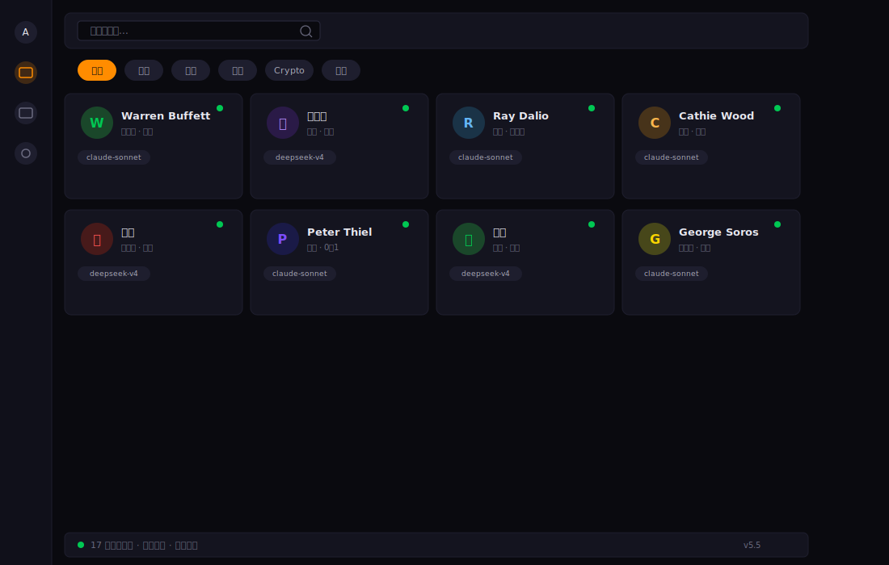
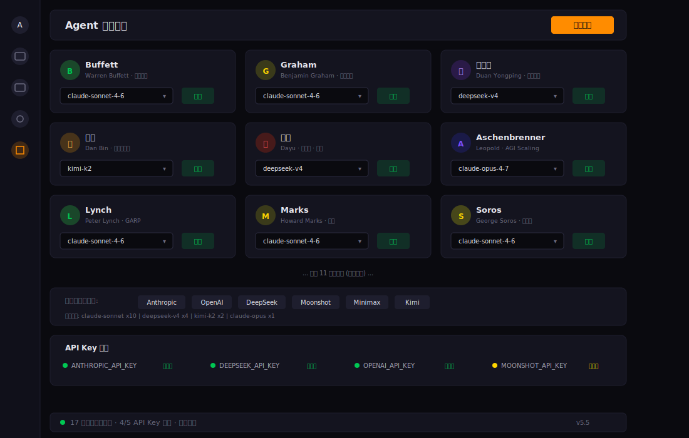

[English](README_EN.md) | 中文

<p align="center">
  
  
  
  
  
</p>

<h1 align="center">Augur</h1>
<h3 align="center">你的AI投资决策委员会</h3>

<p align="center">
  
</p>

<p align="center">
  <strong>18位AI投资大师同时分析一只股票，给你一个加权共识信号。</strong>
</p>

---

## 3秒看懂

- **它是什么** - 18位虚拟投资大师组成的多智能体分析系统（巴菲特、芒格、段永平、张磊、Serenity...）
- **它做什么** - 输入一个股票代码，18位大师各自独立分析并评分，系统输出加权共识信号
- **它有何不同** - 不是单一策略，而是多维度智慧碰撞；覆盖美股/港股/A股/Crypto；部署到CLI/API/Dashboard/Bot全平台

---

## 快速开始

```bash
git clone https://github.com/BruceLanLan/augur.git && cd augur
pip install -e .
augur analyze AAPL
```

输出示例:
```
=== AAPL 18位大师共识分析 ===

共识信号: BUY | 综合评分: 7.4/10 | 建议仓位: 8%

  Buffett:       BUY  (8.0/10) - 护城河宽广，毛利率46%满足要求
  Graham:        HOLD (6.5/10) - PE=32偏高，安全边际不足
  Lynch:         BUY  (7.5/10) - PEG合理，营收增速健康
  Munger:        BUY  (7.8/10) - 多元化优势，生态系统强大
  Dalio:         HOLD (6.0/10) - 宏观不确定性偏高
  段永平:        BUY  (8.2/10) - 商业模式清晰，管理层本分
  张磊:          BUY  (7.5/10) - 结构性赛道，长期确定性高
  Serenity:      HOLD (5.5/10) - 非半导体供应链核心标的
  ...

Kelly建议仓位: 8% | 风险否决: 未触发
```

---

## v6.0 新特性

- **一键分析** - Dashboard首页输入代码即刻获得结果，无需跳转
- **内联结果展示** - 分析结果直接在当前页面渲染，Bloomberg风格评分卡片
- **预设配置** - 一键快速分析AAPL/NVDA/TSLA等热门标的
- **18位投资大师** - 新增第18位: Serenity (@aleabitoreddit) - AI/半导体供应链瓶颈交易

完整变更日志见 [docs/CHANGELOG.md](docs/CHANGELOG.md)

---

## 核心能力

- **18位独立投资人格** - 价值投资、成长股、宏观交易、Crypto、AI地缘政治...每位大师有独立人格与评分逻辑
- **6层加权共识引擎** - 行业感知 + 市场机制路由 + 滚动IC + 多样性惩罚 + Kelly仓位 + 风险否决
- **实时数据接入 (yfinance)** - 自动获取美股/港股/A股价格、估值、基本面和技术指标
- **Bloomberg风格Dashboard** - 暗色主题，7个页面覆盖完整分析流程
- **多平台Bot** - Telegram / Slack / 微信(3模式) / 飞书(2模式)
- **MCP Server** - 6个工具，供 Claude Desktop / Hermes 等直接调用
- **历史回测 + IC追踪** - 回放历史数据，追踪每位Agent预测准确率
- **Cron定时推送** - 自选股监控，定时推送到全平台
- **YAML自定义人格** - 无需写代码，YAML文件即可创建自定义投资策略Agent

---

## 18位投资大师

### 经典价值派

| # | 投资人 | Skill | 风格 | 核心指标 |
|---|--------|-------|------|---------|
| 1 | Warren Buffett | `augur-buffett` | 护城河价值投资 | 毛利率>40%, ROE>15%, 负债<50% |
| 2 | Benjamin Graham | `augur-graham` | 深度价值/安全边际 | PE<15, PB<1.5, 流动比>2 |
| 5 | Charlie Munger | `augur-munger` | 格栅理论/多元思维 | ROE>20%, 护城河+管理层 |
| 9 | Philip Fisher | `augur-fisher` | 成长股/闲聊法 | 研发>10%, 毛利率>50% |

### 成长与动量

| # | 投资人 | Skill | 风格 | 核心指标 |
|---|--------|-------|------|---------|
| 3 | Peter Lynch | `augur-lynch` | GARP成长 | PEG<1.5, 营收增速>15% |
| 8 | Cathie Wood | `augur-cathie-wood` | 颠覆性创新 | 营收增速>30%, TAM |
| 13 | Peter Thiel | `augur-thiel` | 从0到1垄断 | 网络效应, 技术壁垒 |

### 宏观与周期

| # | 投资人 | Skill | 风格 | 核心指标 |
|---|--------|-------|------|---------|
| 4 | Ray Dalio | `augur-dalio` | 宏观/全天候 | 四象限分析, 债务周期 |
| 6 | George Soros | `augur-soros` | 反身性/宏观交易 | 反身性信号, 趋势动量 |
| 7 | Howard Marks | `augur-marks` | 周期/逆向投资 | 周期位置, 市场情绪 |

### 前沿科技与Crypto

| # | 投资人 | Skill | 风格 | 核心指标 |
|---|--------|-------|------|---------|
| 10 | ARPS | `augur-arps` | Crypto/黄金宏观 | BTC相关性, 黄金避险 |
| 11 | Leopold Aschenbrenner | `augur-aschenbrenner` | AI地缘政治 | AI投入, 算力需求 |
| 12 | 大宇 (BTCdayu) | `augur-dayu` | 信息差/情绪动量 | 情绪动量>估值 |
| 18 | Serenity (@aleabitoreddit) | `augur-serenity` | AI/半导体供应链瓶颈交易 | 营收增速>30%, 半导体行业 |

### 中国投资人

| # | 投资人 | Skill | 风格 | 核心指标 |
|---|--------|-------|------|---------|
| 14 | 段永平 | `augur-duan-yongping` | 本分/极度集中 | 商业模式清晰, 管理层本分 |
| 15 | 张磊 (高瓴) | `augur-zhang-lei` | 长期结构性价值 | 营收增速>15%, 结构性赛道 |
| 16 | 李录 (喜马拉雅) | `augur-li-lu` | 深度价值/安全边际 | PE<25, ROE>12%, 无高负债 |
| 17 | 但斌 (东方港湾) | `augur-dan-bin` | 品牌护城河/时代Beta | 毛利率>40%, 定价权 |

> 每位投资人: 完整人格文档(`personas/*.md`) + 独立Skill(`skills/*/SKILL.md`) + Python分析引擎(`src/augur/personas/*.py`)

---

## 使用方式

### CLI (15+ 命令)

```bash
# 核心分析
augur analyze AAPL                    # 单标的 (自动获取实时数据)
augur consensus NVDA                  # 18位大师共识
augur list-personas                   # 列出所有投资人
augur fetch 0700.HK --json            # 仅获取市场数据

# 服务启动
augur mcp-server                      # MCP Server (stdio)
augur api --port 8900                 # REST API

# 平台Bot
augur telegram                        # Telegram Bot
augur slack                           # Slack Bot
augur wechat                          # 个人微信 (GeWeChat)
augur wechat --mode wecom             # 企业微信
augur lark                            # 飞书

# 定时与监控
augur cron-start                      # 定时守护进程
augur watchlist-add AAPL --pe 32      # 添加自选股

# 回测
augur backtest AAPL --days 60 --live  # 真实历史数据回测
augur ic-report                       # IC 排行榜
```

### REST API

```bash
# 18位大师共识
curl http://localhost:8000/api/analyze/AAPL

# 获取实时行情
curl http://localhost:8000/api/fetch/NVDA

# 投资人列表
curl http://localhost:8000/api/personas

# 模型配置
curl http://localhost:8000/api/config
```

完整API端点: `/api/analyze/{ticker}` | `/api/fetch/{ticker}` | `/api/search` | `/api/personas` | `/api/persona/{id}` | `/api/config` | `/api/models` | `/api/custom-persona` | `/api/backtest/run` | `/api/backtest/leaderboard` | `/health`

### MCP Server (6 Tools)

```yaml
# Hermes 配置
mcp_servers:
  augur-agents:
    command: augur
    args: [mcp-server]
```

```json
// Claude Desktop 配置
{
  "mcpServers": {
    "augur-agents": {
      "command": "augur",
      "args": ["mcp-server"]
    }
  }
}
```

工具: `augur_analyze` | `augur_consensus` | `augur_list_personas` | `augur_configure` | `augur_create_persona` | `augur_debate`

---

## Dashboard

Bloomberg Terminal风格的暗色主题Web界面，7个页面覆盖完整分析流程。

```bash
python3 -m dashboard.app --port 8000 --cors
# 访问 http://localhost:8000
```

<p align="center">
  
  <br><em>股票分析页 - 输入代码即得18位大师共识评分</em>
</p>

<p align="center">
  
  <br><em>投资人页 - 18位大师卡片网格</em>
</p>

<p align="center">
  
  <br><em>设置页 - 每位投资人独立模型配置</em>
</p>

| 页面 | 路径 | 说明 |
|------|------|------|
| 首页 | `/` | 快速分析 + 预设标的 |
| 人格 | `/personas` | 18位大师卡片 |
| 股票分析 | `/stocks` | 深度分析 + 评分 |
| 信号监控 | `/signals` | 自选股扫描 |
| 回测 | `/backtest` | 历史回测 + IC |
| 设置 | `/settings` | 模型配置 |
| 创建人格 | `/create_persona` | YAML自定义 |

---

## 平台Bot

### Telegram
```bash
pip install 'augur-agents[telegram]'
export TELEGRAM_TOKEN='your-bot-token'
augur telegram
```
命令: `/analyze AAPL` | `/consensus NVDA` | `/ask buffett 分析AAPL` | 支持自然语言 `@巴菲特 分析AAPL`

### Slack
```bash
pip install 'augur-agents[slack]'
export SLACK_BOT_TOKEN='xoxb-...' SLACK_APP_TOKEN='xapp-...'
augur slack
```
命令: `/augur-analyze AAPL` | 频道 `@augur analyze AAPL` | Block Kit 富文本输出

### 微信 (3种模式)
```bash
pip install 'augur-agents[wechat]'
# 个人微信 (推荐, GeWeChat扫码即用)
augur wechat --mode personal --port 8066
# 企业微信
augur wechat --mode wecom --port 8080
# Webhook (仅推送)
augur wechat --mode webhook
```

### 飞书 (2种模式)
```bash
pip install 'augur-agents[lark]'
# Event订阅 (双向)
augur lark --mode event --port 9000
# Webhook (仅推送)
augur lark --mode webhook
```

---

## 架构

<p align="center">
  
</p>

```
augur/
├── src/augur/                  # pip包主模块
│   ├── cli.py                  # Click CLI (15+ commands)
│   ├── mcp_server.py           # MCP Server (6 tools, stdio)
│   ├── api.py                  # REST API (FastAPI)
│   ├── registry.py             # AgentRegistry + DecisionCoordinator
│   ├── data.py                 # 实时数据 (yfinance)
│   ├── backtest.py             # 历史回测 + IC
│   ├── cron.py                 # 定时分析 + Watchlist
│   ├── bots/                   # 多平台Bot
│   │   ├── telegram_bot.py
│   │   ├── slack_bot.py
│   │   ├── wechat_bot.py
│   │   └── lark_bot.py
│   └── personas/               # 18位投资人Agent
│       ├── base.py
│       ├── buffett.py ... serenity.py
│       └── (18个Python模块)
├── dashboard/                  # Bloomberg风格Web UI
│   ├── app.py                  # FastAPI + 路由
│   └── templates/              # 7个页面模板
├── skills/                     # 独立Skill (agentskills.io)
├── personas/                   # 投资人深度文档 + custom/ YAML
├── config/agents.yaml          # Agent LLM模型配置
├── pyproject.toml              # pip包配置 (augur-agents)
├── Dockerfile                  # 容器化
└── docker-compose.yml          # 多服务编排
```

**共识机制 (6层加权):**

1. 行业感知权重 - 科技股给 Wood/Aschenbrenner 更高权重
2. 市场机制路由 - 熊市时 Marks/Dalio 权重提升
3. 滚动IC权重 - 历史准确率高的Agent动态加权
4. 多样性惩罚 - 观点相似的Agent减少冗余权重
5. Kelly仓位建议 - 基于共识和置信度给出仓位比例
6. 风险否决层 - 高负债+熊市时可否决共识看多

---

## Docker 部署

```bash
# Dashboard + API
docker compose up -d dashboard        # http://localhost:8000

# Telegram Bot
export TELEGRAM_TOKEN=your_token
docker compose --profile telegram up -d

# 全部服务
docker compose --profile full --profile telegram --profile cron up -d

# Makefile
make docker-build && make docker-up
```

---

## 贡献

1. **新投资人** - `personas/custom/` 添加YAML，或参考 `src/augur/personas/buffett.py` 写Python Agent
2. **新Skill** - 参考 `skills/buffett/SKILL.md` 格式
3. **算法优化** - 改进评分逻辑或共识机制
4. **Bot适配** - 在 `src/augur/bots/` 添加新平台
5. **Web UI** - 完善 `dashboard/` 前端

---

## Star History

<a href="https://www.star-history.com/?repos=BruceLanLan%2Faugur&type=timeline&logscale=&legend=top-left">
 <picture>
   <source media="(prefers-color-scheme: dark)" srcset="https://api.star-history.com/chart?repos=BruceLanLan/augur&type=timeline&theme=dark&legend=top-left" />
   <source media="(prefers-color-scheme: light)" srcset="https://api.star-history.com/chart?repos=BruceLanLan/augur&type=timeline&legend=top-left" />
   
 </picture>
</a>

---

## License

MIT License - 详见 [LICENSE](LICENSE)

<p align="center">
  <sub>Built with care by <a href="https://github.com/BruceLanLan">BruceLanLan</a></sub>
</p>
