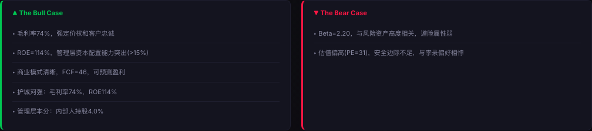
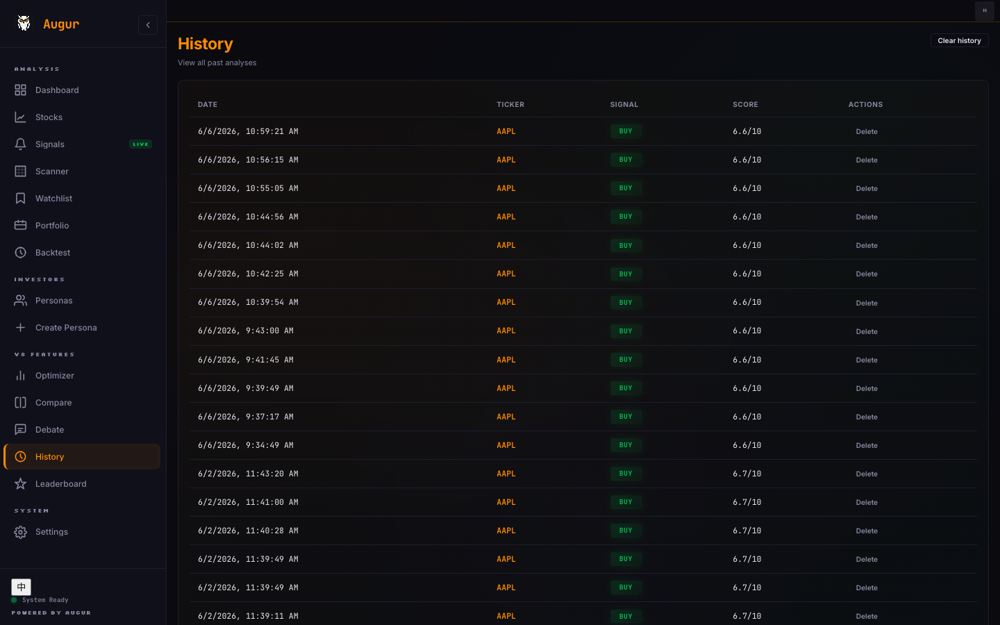
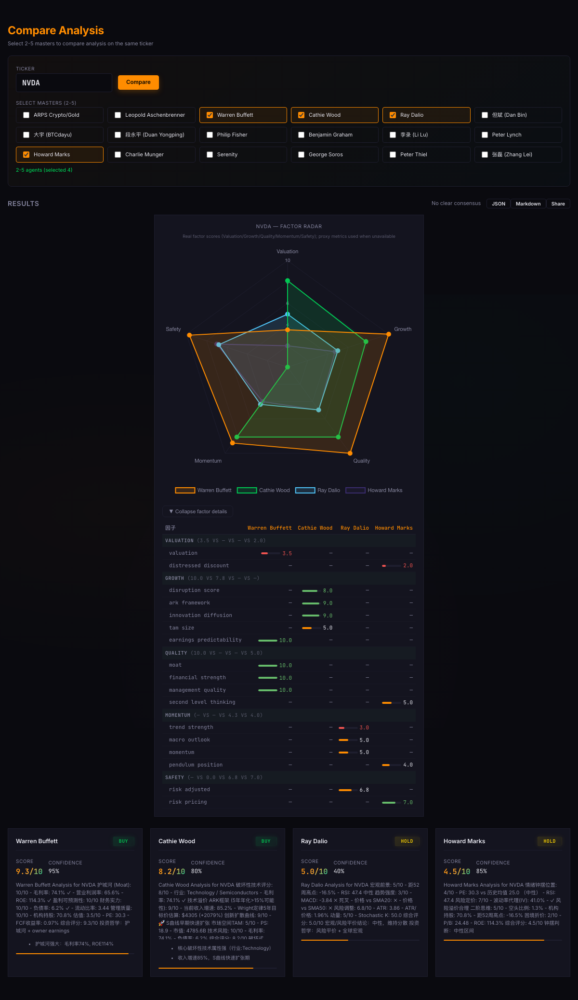

🇨🇳 中文 | [🇺🇸 English](README_EN.md)

<div align="center">


# 🦉 Augur

**不是又一个 AI 股票分析工具。是一个帮你记住"你何时知道什么、什么变了、谁在什么事实上分歧"的研究记忆系统。**

[](https://github.com/BruceLanLan/augur-next)
[](https://github.com/BruceLanLan/augur-next/actions)
[](#-为什么-augur-不一样)
[](#-18位投资大师)
[](https://modelcontextprotocol.io)
[](#-安装)
[](LICENSE)

</div>

---

## 🤔 为什么 Augur 不一样

大多数 AI 金融工具会给你一个答案。Augur 给你的是**可验证的研究产物**。

区别在哪？假设你问一个 AI "AAPL 值得买吗"——

| | 普通 AI 工具 | Augur |
|---|---|---|
| 给你什么 | 一段 "一方面…另一方面…" 的分析，最后加一句 "投资有风险" | 18 位大师的独立判断 + 他们在什么事实上一致、在什么事实上打架 |
| 数据从哪来 | 不知道。可能是训练数据里的记忆 | 每条结论带 source locator — SEC filing URL、accession number、获取时间 |
| 缺失数据怎么处理 | 静默填 0。你以为它有数据，其实没有 | 显式标注 `missing`。依赖该字段的大师明确 `abstain` 并说明原因 |
| 三个月后回头看 | 不记得上次说了什么 | RunBundle 保存了整个运行的输入快照、步骤结果、覆盖统计。可以和这次对比，精确知道 "什么变了" |
| 你的数据在哪 | 云端。你不知道谁在看 | 本地。`~/.augur`。你控制一切 |

**Augur 不是帮你做决策，是帮你建立决策的 evidence trail。**

---

## 🚀 30秒上手

```bash
git clone https://github.com/BruceLanLan/augur-next.git && cd augur-next
pip install -e ".[data]"

# (推荐) 设置独立数据目录，不污染 ~/.augur
export AUGUR_DATA_DIR=$(pwd)/.augur_dev

augur serve --open          # 打开 Dashboard
```

或者直接在命令行：

```bash
augur analyze AAPL          # 18位大师同时分析
augur consensus NVDA        # 加权共识
augur workflow TSLA         # 六步分析流水线
```

---

## ✨ v11：从 "AI 报告" 到 "研究记忆"

v11 是一次**地基重建**。我们没有加新的 dashboard 页面，没有加第 19 个大师，没有做 portfolio tracking。我们做了一件更基础的事：**让 Augur 说过的每一句话都能被验证、被复现、被比较。**

### 1. 缺失数据不再是 0

这是 v11 最重要的修复。

之前：`insider_ownership` 和 `institutional_ownership` 在历史回放中默认值是 `0`。11 位依赖这些字段的大师——Buffett、Munger、Li Lu、段永平——在"不知道"的情况下给出了 "确认为零持股" 的判断。

现在：`None`。缺失就是缺失。依赖它的大师明确 `abstain`，输出机器可读的降级原因。不是什么魔法修复——只是诚实。

### 2. 每条数据带三个时间

```python
EvidenceItem(
    effective_at=datetime(2025, 9, 28),   # ← 业务时点：Q4 结束日
    available_at=datetime(2025, 10, 31),   # ← 市场最早能知道的时间：filing 日
    retrieved_at=datetime(2025, 11, 1),    # ← 系统获取时间：下载日
)
```

为什么这很重要？因为如果你在 10 月 15 日做回测、却用了 10 月 31 日才公开的 13F 数据——那就是 look-ahead bias。几乎所有竞品都在用 `retrieved_at` 替代 `available_at`。Augur 拒绝这种替代。**这是整个产品最深的技术护城河。**

### 3. 每次运行留下不可变快照

```
run_AAPL_20251101T120000_abc12345.json
├── manifest: 输入 hash + 配置/模型/代码版本
├── step_results:
│   ├── fetch   → success, 234ms, content_hash=f3a2…
│   ├── analyze → success, 12.4s, 18 persona outputs
│   ├── consensus → success, score=7.2, Brier=0.14
│   └── debate  → degraded, 2 agent timeout
└── coverage: 24 total, 18 covered, 4 missing, 2 degraded
```

中断了？checkpoint 从断点恢复。想比较两次运行？不用重新生成——diff 两个 RunBundle 就知道什么变了。外部 Agent 通过 MCP 只读访问：`augur://runs/{run_id}`。

### 4. 内置研究 Skill（声明式，不包含代码）

```bash
augur skill run earnings-prep --ticker AAPL   # 财报前研究包
augur skill run filing-delta --ticker AAPL    # Filing 变化对比
```

两个 Skill 都是纯 YAML 声明——不包含 `module_path`、`shell`、`import`、`eval`。运行时权限由 `SkillPermissionEnforcer` 逐项检查，拒绝访问记录到 audit log。这意味着**你可以信任一个 Skill 而不用读它的源代码**。

### 5. 信任底座加固

- **测试隔离**：`AUGUR_DATA_DIR` 环境变量控制全部持久化路径。240+ 测试在独立 temp 目录运行，不碰真实 `~/.augur`
- **安全基线**：PBKDF2 从 100k 升至 600k 迭代（OWASP 2025）；SQLite 损坏时 rename-to-backup 不再删除用户数据库
- **校准诚实**：每个概率输出标注 `raw` / `experimental` / `validated-calibrated` / `insufficient_data`。未经 OOS gate 验证的权重不以默认启用。样本不足时不显示 "已校准"

完整变更 → [`docs/RELEASE_NOTES_v11.md`](docs/RELEASE_NOTES_v11.md)  ·  Schema 参考 → [`docs/schema-reference.md`](docs/schema-reference.md)  ·  Skill 使用 → [`docs/skills-guide.md`](docs/skills-guide.md)

---

## 📊 Dashboard 全貌


### 股票分析


输入任意股票代码（A股 / 美股 / 港股），18位大师同时给出：
- **Augur 评分**（0–10）+ **BUY / NEUTRAL / SELL** 信号
- **Kelly 仓位建议**（基于加权共识置信度）
- **The Oracle of Augur**：一句话裁决
- 多空分布

### 投资委员会


五套预设委员会，自由组合：
- **经典价值**：Buffett · Graham · Munger · Fisher
- **中国价值**：段永平 · 张磊 · 李录 · 但斌
- **宏观全天候**：Dalio · Soros · Marks · ARPS
- **创新成长**：Cathie Wood · Thiel · Aschenbrenner · Lynch
- **全体委员会**：18位全部出席

### 多空辩论 · 历史记录 · 对比分析

  

结构化多空辩论 · GitHub 风格 52 周热力图 · 五维度雷达图对比分歧

---

## 🎭 18位投资大师

> 4 大流派，覆盖价值 / 成长 / 宏观 / 中国市场。中国大师**全程中文对话**。

| 流派 | 大师 |
|------|------|
| 🏦 经典价值 | Warren Buffett · Benjamin Graham · Charlie Munger · Philip Fisher |
| 🚀 成长创新 | Peter Lynch · Cathie Wood · Peter Thiel · Leopold Aschenbrenner |
| 🌍 宏观周期 | Ray Dalio · George Soros · Howard Marks · ARPS Crypto/Gold |
| 🇨🇳 中国价值 | 段永平 · 张磊（高瓴）· 李录（喜马拉雅）· 但斌（东方港湾）· 大宇 BTCdayu |
| ⚙️ 特殊策略 | Serenity（AI算力供应链）|

每位大师都有独立的分析哲学、scoring weights 和 Hermes Skill。

---

## 🔌 接入任意平台

| 平台 | 接入方式 |
|------|---------|
| **Web Dashboard** | `augur serve` |
| **Claude Desktop** | MCP 配置 → `augur mcp-server` |
| **Hermes Agent** | `/skill augur-buffett` |
| **Claude Code** | `.mcp.json` 自动发现（克隆即用） |
| **OpenClaw** | YAML manifest 自动注册 |
| **Telegram / Slack** | `augur telegram` / `augur slack` |
| **外部 Agent (v11 新增)** | `augur://evidence/{id}` · `augur://runs/{id}` MCP resources |

### MCP 工具一览

```json
// Claude Desktop (~/.config/claude/claude_desktop_config.json)
{
  "mcpServers": {
    "augur": { "command": "augur", "args": ["mcp-server"] }
  }
}
```

| 工具 | 用途 |
|------|------|
| `mcp_augur_analyze` | 单个或全部大师分析 |
| `mcp_augur_consensus` | 加权共识 + Kelly 仓位 |
| `mcp_augur_committee` | 投委会（独立意见 + 裁决） |
| `mcp_augur_debate` | 多轮结构化辩论 |
| `mcp_augur_workflow` | 完整分析流水线 |
| `mcp_augur_workspace_get` | 读取你的终端配置 |
| `mcp_augur_workspace_set` | 修改你的终端配置 |
| `mcp_augur_workspace_profiles` | 管理 Profile |
| `mcp_augur_fetch` | 实时行情 |
| `mcp_augur_sentiment` | 社交情绪分析 |
| `mcp_augur_create_persona` | 创建自定义大师 |
| `mcp_augur_list_personas` | 列出全部大师 |
| `mcp_augur_configure` | 配置模型参数 |

---

## 💻 CLI 完整命令

```bash
# 分析
augur analyze AAPL                              # 18位大师共识
augur analyze AAPL --persona buffett            # 单个大师
augur consensus NVDA                            # 加权共识 + Kelly 仓位
augur report AAPL -o report.md                  # 生成深度分析报告
augur committee AAPL -q "护城河是在变宽还是变窄？" # 投资委员会
augur chat AAPL --persona buffett               # 快速对话
augur workflow TSLA --steps fetch,analyze,consensus,committee

# 数据
augur fetch AAPL                                # 实时行情 + 财务指标
augur sentiment AAPL                            # 社交情绪分析
augur guidance AAPL                             # AI 提炼管理层展望

# Dashboard
augur serve --port 8000 --open                  # 启动并自动打开浏览器

# 监控
augur watch AAPL NVDA TSLA                      # 60s 刷新
augur watch NVDA --alert-above 7.5             # 评分超阈值提醒

# 组合与回测
augur portfolio AAPL NVDA TSLA                 # Kelly 配置建议
augur backtest AAPL --days 30                  # 真实历史数据回测
augur ic-report                                # Agent IC 排行榜

# 自选股 + 定时任务
augur watchlist-add AAPL --pe 30 --roe 0.55
augur watchlist-show
augur cron-run                                  # 手动跑一次自选股分析
augur cron-start                                # 启动定时调度守护进程

# Agent
augur mcp-server                               # 启动 MCP server（stdio）
augur skills                                   # 列出所有 Skill
augur skills --school value                    # 按流派筛选
augur inject-soul -p my_profile --persona buffett  # 把大师人格注入到某个 Agent 配置

# Bot
augur telegram / augur slack / augur wechat / augur lark

# 排障
augur doctor                                    # 环境自检
augur doctor --offline                          # 跳过真实网络请求
```

---

## 🎨 创建专属大师

```bash
# 方式一：Dashboard 无代码构建器
augur serve
# 访问 http://localhost:8000/create-persona

# 方式二：YAML 文件
cat > personas/custom/my_quant.yaml << EOF
agent_id: my_quant
name: "我的量化策略"
philosophy: ["动量", "价值", "低波动"]
scoring_weights:
  momentum: 0.40
  value: 0.35
  safety: 0.25
EOF
augur analyze AAPL --persona my_quant

# 方式三：MCP 工具
mcp_augur_create_persona(yaml_content="agent_id: ...")
```

---

## 🗺️ 开发路线图

当前项目审计、仓库分工和 7 天 v11 Release Candidate 冲刺计划见 [docs/ROADMAP.md](docs/ROADMAP.md)；后续功能与产品方向见 [docs/PRODUCT_DIRECTIONS.md](docs/PRODUCT_DIRECTIONS.md)；竞品调研与差异化策略见 [docs/DIFFERENTIATION_STRATEGY.md](docs/DIFFERENTIATION_STRATEGY.md)；金融平台、分析 Agent 与 Skill/MCP 的融合方案见 [生态调研](docs/research/FINANCIAL_PLATFORM_AGENT_SKILL_BENCHMARK_2026-08-11.md)。

---

## 📝 更新日志

<details open>
<summary><strong>v11.0.0-rc1 — Research Memory System (current)</strong></summary>

v11 是一次地基重建。核心交付：

- **EvidenceItem / Claim / StepResult / RunBundle** 四个不可变 schema
- **三类时间语义**（effective_at / available_at / retrieved_at），拒绝 look-ahead bias
- **缺失数据显式传播**：ownership 字段 `0 → None`，11 位 persona 显式 abstain
- **RunTracker**：checkpoint 保存/恢复，RunBundle 持久化
- **两个内置 Skill**（`earnings-prep`、`filing-delta`）+ Capability registry + 权限执行器
- **安全基线**：PBKDF2 600k、SQLite corruption backup、统一 CORS
- **MCP resources**：`augur://evidence/{id}` · `augur://runs/{id}`
- **Rolling IC OOS harness** + 校准状态标注

详见 [docs/RELEASE_NOTES_v11.md](docs/RELEASE_NOTES_v11.md)。
</details>

<details>
<summary><strong>v10.15.0 — 公开同步发布</strong></summary>

距 v10.0.0 三周半的开发成果同步：SEC EDGAR 真实基本面、三处可信度修复、`augur doctor`、数据源连通性历史、因子级归因分析。2461 个测试全部通过。详见 [docs/RELEASE_NOTES.md](docs/RELEASE_NOTES.md)。
</details>

<details>
<summary><strong>v10.14.0 ~ v10.9.0 — 迭代记录</strong></summary>

v10.14: rolling_ic.json 生成器 · v10.13: 因子级归因分析 · v10.12: 每周真实网络烟测 · v10.11: 数据源连通性历史 · v10.10: augur doctor 环境自检 · v10.9: SEC EDGAR 真实数据 + 可信度全面修复
</details>

<details>
<summary><strong>v10.0.0 — 终端工作区 + Agentic 工作流</strong></summary>

Bloomberg 风格多套 Profile、布局预设、大师子集过滤。6 步分析流水线。WebSocket 实时推送。13 MCP 工具。2136 测试通过。
</details>

<details>
<summary><strong>v9.0.x 及更早</strong></summary>

v9: Hermes Agent + 委员会体系 · v8: HD-2D 设计系统 + Optimizer + AI 对话
</details>

---

<div align="center">

MIT License · Built with ❤️ by <a href="https://github.com/BruceLanLan">BruceLanLan</a>

*仅供学习研究，不构成投资建议*

</div>
