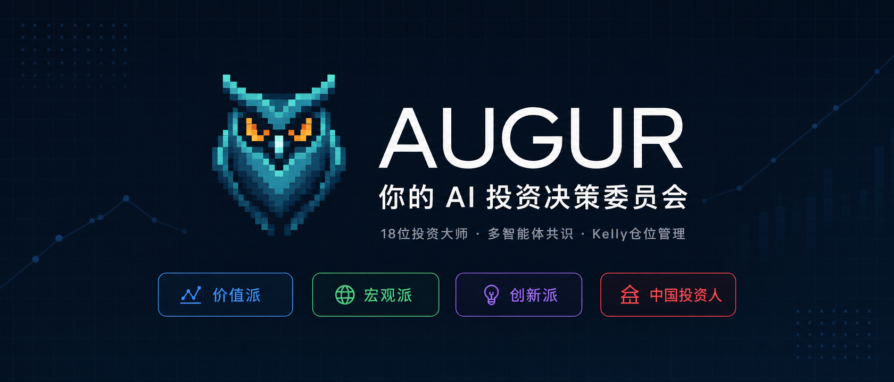
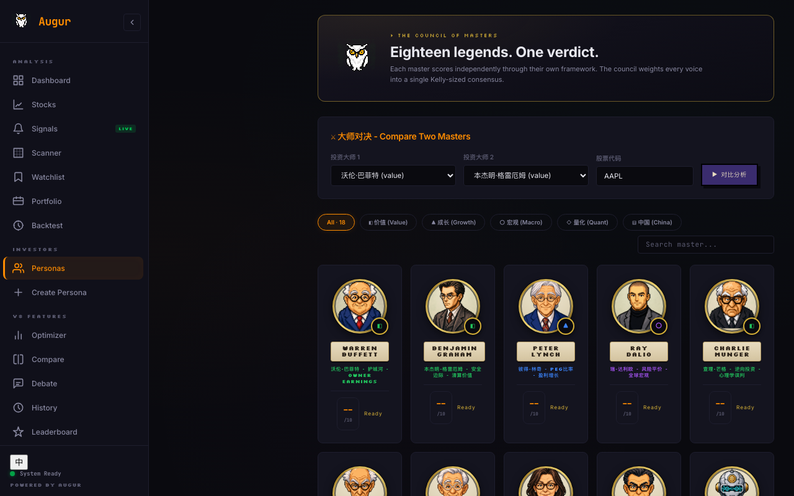

🇨🇳 中文 | [🇺🇸 English](README_EN.md)

<div align="center">



# 🦉 Augur

**不是又一个 AI 股票分析工具。是一个帮你记住"你何时知道什么、什么变了、谁在什么事实上分歧"的研究记忆系统。**

[](https://github.com/BruceLanLan/augur-next)
[](https://github.com/BruceLanLan/augur-next/actions)
[](#-为什么-augur-不一样)
[](#-18位投资大师)
[](https://modelcontextprotocol.io)
[](#-安装)
[](LICENSE)

</div>

---

## 🤔 为什么 Augur 不一样

大多数 AI 金融工具会给你一个答案。Augur 给你的是**可验证的研究产物**。

区别在哪？假设你问一个 AI "AAPL 值得买吗"——

| | 普通 AI 工具 | Augur |
|---|---|---|
| 给你什么 | 一段 "一方面…另一方面…" 的分析 + "投资有风险" | 18 位大师的独立判断 + 他们在什么事实上一致、在什么事实上打架 |
| 数据从哪来 | 不知道。可能是训练数据里的记忆 | 每条结论带 source locator — SEC filing URL、accession number、获取时间 |
| 缺失数据怎么处理 | 静默填 0。你以为它有数据，其实没有 | 显式标注 `missing`。依赖该字段的大师明确 `abstain` 并说明原因 |
| 三个月后回头看 | 不记得上次说了什么 | RunBundle 保存了输入快照、步骤结果、覆盖统计。可以 diff，精确知道 "什么变了" |
| 你的数据在哪 | 云端。你不知道谁在看 | 本地。`~/.augur`。你控制一切 |

**Augur 不是帮你做决策，是帮你建立决策的 evidence trail。**

---

## 🚀 30秒上手

```bash
git clone https://github.com/BruceLanLan/augur-next.git && cd augur-next
pip install -e ".[data]"

# (推荐) 设置独立数据目录
export AUGUR_DATA_DIR=$(pwd)/.augur_dev

augur serve --open          # 打开 Dashboard · ⌘K 唤出命令面板
```

或者纯命令行：

```bash
augur analyze AAPL          # 18位大师同时分析
augur workflow TSLA         # 六步分析流水线
augur export AAPL --format md  # 导出 Markdown 报告
```

---

## ✨ v11 有什么新的

v11 是一次**从 "AI 报告生成器" 到 "Research Memory System" 的全面升级。**

### 🔬 24 个新模块，覆盖完整研究闭环

```
┌──────────────────────────────────────────────────────┐
│  研究前        研究执行        研究后                │
│  ─────        ────────        ─────                 │
│  earnings     workflow        thesis                 │
│  guidance     disagreement    filing_delta           │
│  skills       valuation       export                 │
│               eval_lab        risk_review            │
│               run_tracker     research_inbox         │
└──────────────────────────────────────────────────────┘
```

| 模块 | 做什么 | 一句话 |
|---|---|---|
| `thesis.py` | Thesis Journal + Delta + Decision Log | 追踪你的投资论文，记录何时被证伪 |
| `valuation.py` | DCF + WACC + Scenario Lab | 纯 `decimal.Decimal`，LLM 不碰算术 |
| `disagreement.py` | 18 persona → 3-5 conflicts | 不是 18 份报告，是 3 个决策相关分歧 |
| `filing_delta.py` | 20+ metrics + text + guidance | 新 filing 相比上一份：数字变了多少、风险变了什么 |
| `guidance_tracker.py` | Guidance 区间追踪 + 准确率 | "管理层上次说 Q4 营收 92-96B，实际呢？" |
| `research_inbox.py` | 事件聚合优先队列 | 财报临近 + filing 变化 + thesis 需要 review → 一个 inbox |
| `risk_review.py` | Risk factor + covenant review | 新增/升级/删除的风险因素 + 债务约束检查 |
| `scorecard.py` | Post-earnings Scorecard + Language Diff | 事前预测 vs 实际结果 + 管理层措辞变化检测 |
| `capital_allocation.py` | Capital Allocation + Peer Comparison | 回购/分红/M&A/capex + 同行业对标 |
| `questions.py` | Open Questions Queue + Templates | 跨事件保留未解决问题 + 可复用研究 SOP 模板 |
| `debate_engine.py` | Evidence-seeking Debate | 4-stage: claim→challenge→requery→revision |
| `eval_lab.py` | Walk-forward OOS + persona ablation | 谁真的有增量预测能力？不是靠嘴说 |
| `export.py` | Markdown / PDF / JSON / Evidence Pack | 一键导出可分发的研究证据包 |
| `earnings.py` | 财报事件识别 + dossier readiness | watchlist → 发现临近财报 → 检查数据是否就绪 |
| `run_tracker.py` | StepResult wrapper + checkpoint | 中断了？从断点恢复，不重新请求已完成步骤 |
| `provenance.py` | ProvenanceBlock | 每条报告标注来源、新鲜度、谁被跳过、为什么 |
| `capability.py` | Capability Registry | 注册、验证、预算/超时控制的原子能力 |
| `schemas/` | EvidenceItem / Claim / StepResult / RunBundle / SkillSpec v1 | 五个不可变数据合约 |

### 1. 缺失数据不再是 0

`insider_ownership` 和 `institutional_ownership` 缺失 → `None`（不是 `0`）。依赖它们的大师明确 `abstain`。

### 2. 每条数据带三个时间

```python
EvidenceItem(
    effective_at=datetime(2025, 9, 28),   # 业务时点
    available_at=datetime(2025, 10, 31),   # 市场最早能知道的时间
    retrieved_at=datetime(2025, 11, 1),    # 系统获取时间
)
```

`available_at` ≠ `retrieved_at`。这是 Augur 最深的技术护城河——拒绝 look-ahead bias。

### 3. 每次运行留下不可变快照

```
run_AAPL_20251101T120000_abc12345.json
├── manifest: 输入 hash + 配置/模型/代码版本
├── step_results: fetch → analyze → consensus → debate
└── coverage: 24 total, 18 covered, 4 missing, 2 degraded
```

中断？checkpoint 恢复。比较两次运行？diff RunBundle。外部 Agent 只读：`augur://runs/{run_id}`。

### 4. 声明式 Skill（不包含代码）

```bash
augur skill run earnings-prep --ticker AAPL
augur skill run filing-delta --ticker AAPL
```

纯 YAML — 不包含 `module_path`、`shell`、`import`。运行时 `SkillPermissionEnforcer` 逐项检查。

### 5. UI/UX 全面升级

- **⌘K 命令面板**：15 个快捷操作，全局搜索
- **暗色模式**：`prefers-color-scheme` 自动 + 手动切换
- **Evidence Graph**：力导向图 + zoom/pan/touch + DisagreementMap 渲染
- **Thesis Journal 页面**：`/thesis` — 创建、追踪、回顾投资论文
- **骨架屏 + 空状态 + Toast**：完整的加载体验设计
- **响应式**：移动端/平板/桌面三档适配

### 6. 信任底座

- **431 tests**，AUGUR_DATA_DIR 隔离，零用户目录污染
- PBKDF2 600k、SQLite WAL + 损坏 rename-to-backup
- 校准状态标注：`raw` / `experimental` / `validated-calibrated` / `insufficient_data`

---

## 📊 Dashboard 全貌



| 页面 | 路径 | 功能 |
|---|---|---|
| 首页 | `/` | 实时行情 + 大师概览 |
| 股票分析 | `/stocks` | 输入 ticker，18 位大师同时分析 |
| 投资委员会 | `/committee` | 5 套预设 + 自由组合 |
| 多空辩论 | `/debate` | 结构化多轮辩论 |
| 对比分析 | `/compare` | 五维度雷达图 |
| 历史记录 | `/history` | 52 周热力图 |
| **Thesis Journal** | `/thesis` | 🆕 投资论文创建/追踪/回顾 |
| **证据浏览器** | `/history` | 🆕 Evidence Graph 力导向图 |
| 持仓管理 | `/portfolio` | Kelly 配置建议 |
| 自选股 | `/watchlist` | 批量管理 + cron 定时 |
| 设置 | `/settings` | Profile + 布局 + 大师子集 |

---

## 🎭 18位投资大师

> 4 大流派，覆盖价值 / 成长 / 宏观 / 中国市场。中国大师**全程中文对话**。

| 流派 | 大师 |
|------|------|
| 🏦 经典价值 | Warren Buffett · Benjamin Graham · Charlie Munger · Philip Fisher |
| 🚀 成长创新 | Peter Lynch · Cathie Wood · Peter Thiel · Leopold Aschenbrenner |
| 🌍 宏观周期 | Ray Dalio · George Soros · Howard Marks · ARPS Crypto/Gold |
| 🇨🇳 中国价值 | 段永平 · 张磊 · 李录 · 但斌 · 大宇 BTCdayu |
| ⚙️ 特殊策略 | Serenity（AI算力供应链）|

---

## 🔌 接入任意平台

| 平台 | 接入方式 |
|------|---------|
| **Web Dashboard** | `augur serve` → ⌘K 唤出命令面板 |
| **Claude Desktop** | MCP → `augur mcp-server` |
| **外部 Agent** | `augur://evidence/{id}` · `augur://runs/{id}` |

---

## 💻 CLI 命令

```bash
# 分析
augur analyze AAPL                              # 18位大师
augur workflow TSLA --steps fetch,analyze,consensus,committee
augur committee AAPL -q "护城河是在变宽还是变窄？"

# 导出 (v11 新增)
augur export AAPL --format md                   # Markdown 报告
augur export AAPL --format pdf                  # PDF 报告
augur export AAPL --format evidence-pack        # 研究证据包 (.zip)

# Skill (v11 新增)
augur skill run earnings-prep --ticker AAPL
augur skill run filing-delta --ticker AAPL

# 估值 (v11 新增)
augur valuation AAPL                            # DCF 估值

# 数据
augur fetch AAPL · augur sentiment AAPL · augur guidance AAPL
augur backtest AAPL --days 30 · augur ic-report

# 监控
augur watch AAPL NVDA TSLA · augur watchlist-add AAPL
augur cron-run · augur cron-start

# Dashboard
augur serve --port 8000 --open

# Agent / Bot
augur mcp-server · augur skills · augur telegram
```

---

## 🗺️ 文档

| 文档 | 内容 |
|---|---|
| [ROADMAP.md](docs/ROADMAP.md) | 7天 v11 RC 冲刺计划 + backlog |
| [PRODUCT_DIRECTIONS.md](docs/PRODUCT_DIRECTIONS.md) | 产品方向 + 功能机会地图 |
| [DIFFERENTIATION_STRATEGY.md](docs/DIFFERENTIATION_STRATEGY.md) | 竞品差异化策略 + 定位 |
| [RELEASE_NOTES_v11.md](docs/RELEASE_NOTES_v11.md) | v11 完整发布说明 + 迁移指南 |
| [schema-reference.md](docs/schema-reference.md) | EvidenceItem/Claim/RunBundle/SkillSpec 字段参考 |
| [skills-guide.md](docs/skills-guide.md) | Skill 使用教程 + 安全模型 + 自定义 Skill |
| [COMPETITIVE_LANDSCAPE_SUPPLEMENT](docs/research/COMPETITIVE_LANDSCAPE_SUPPLEMENT_2026-08-12.md) | Mira/AI Berkshire/FinSight/LATO 等 8 个竞品深度分析 |
| [FINANCIAL_PLATFORM_BENCHMARK](docs/research/FINANCIAL_PLATFORM_AGENT_SKILL_BENCHMARK_2026-08-11.md) | OpenBB/Qlib/LEAN/TradingAgents 等生态融合方案 |

---

## 📝 更新日志

<details open>
<summary><strong>v11.0.0-rc1 — Research Memory System (current)</strong></summary>

**地基重建**：431 tests, 14 new modules, 116 files changed.

- **Schema 合约**：EvidenceItem（三类时间）、Claim（evidence 分类引用）、StepResult（typed output）、RunBundle（不可变快照）、SkillSpec v1（声明式安全合约）
- **研究闭环**：Thesis Journal → Filing Delta → Disagreement Map → Guidance Tracker → Research Inbox → Risk Review
- **估值引擎**：纯 `decimal.Decimal` DCF + WACC + Scenario Lab + Reverse DCF
- **评估体系**：Chronological Evaluation Lab + Persona Ablation + Rolling IC OOS harness
- **UI/UX**：⌘K Command Palette · Dark Mode · Evidence Graph · Thesis Journal 页面 · 骨架屏/空状态/Toast · 响应式
- **信任底座**：PBKDF2 600k · SQLite WAL + corruption backup · 校准状态标注 · 431 hermetic tests

详见 [docs/RELEASE_NOTES_v11.md](docs/RELEASE_NOTES_v11.md)
</details>

<details>
<summary><strong>v10.15.0 — 公开同步发布</strong></summary>

SEC EDGAR 真实基本面、三处可信度修复、`augur doctor`、2461 tests。
</details>

<details>
<summary><strong>v10.0.0 及更早</strong></summary>

v10: Bloomberg 风格终端 + 6步工作流 + 13 MCP 工具 · v9: Hermes Agent + 委员会体系 · v8: HD-2D 设计系统
</details>

---

<div align="center">

MIT License · Built with ❤️ by <a href="https://github.com/BruceLanLan">BruceLanLan</a>

*仅供学习研究，不构成投资建议*

</div>
