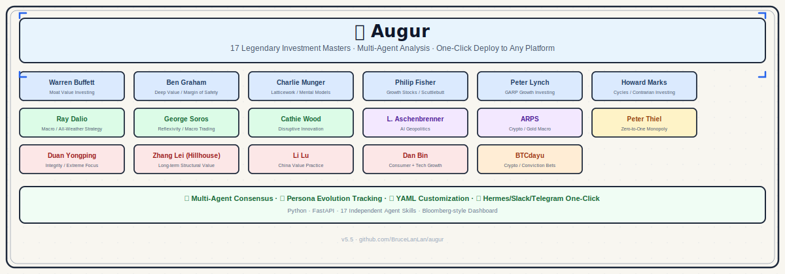
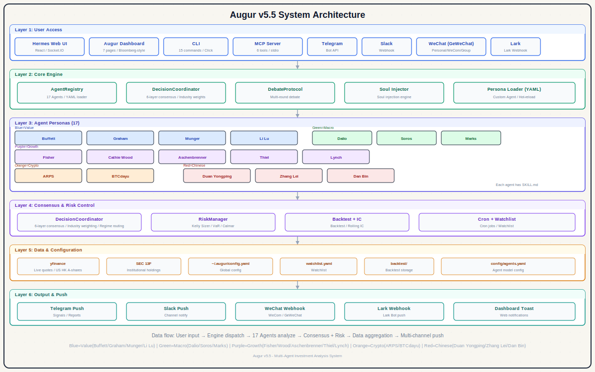

English | [中文](README.md)

<p align="center">
  
  
  
  
  
</p>

<h1 align="center">Augur</h1>
<h3 align="center">Your AI Investment Advisory Board</h3>

<p align="center">
  
</p>

<p align="center">
  <strong>18 AI investment masters analyze a stock simultaneously and deliver one weighted consensus signal.</strong>
</p>

---

## Understand in 3 Seconds

- **What it is** - A multi-agent analysis system composed of 18 virtual investment masters (Buffett, Munger, Duan Yongping, Zhang Lei, Serenity...)
- **What it does** - Enter a stock ticker, 18 masters analyze and score independently, the system outputs a weighted consensus signal
- **What makes it different** - Not a single strategy but multi-dimensional intelligence collision; covers US/HK/A-shares/Crypto; deploys across CLI/API/Dashboard/Bot

---

## Quick Start

```bash
# Clone and install (source install — not yet published to PyPI)
git clone https://github.com/BruceLanLan/augur.git
cd augur
pip install -e .                       # core (Python 3.8+)
pip install -e ".[data]"              # optional: add yfinance for live data

# Analyze (auto-fetches live data if yfinance is installed)
augur analyze AAPL

# 18-master consensus
augur consensus NVDA

# Launch Dashboard
python3 -m dashboard.app --port 8000
# Open http://localhost:8000
```

Example output:
```
=== AAPL 18-Master Consensus Analysis ===

Consensus Signal: BUY | Overall Score: 7.4/10 | Suggested Position: 8%

  Buffett:       BUY  (8.0/10) - Wide moat, 46% gross margin meets requirements
  Graham:        HOLD (6.5/10) - PE=32 is elevated, insufficient margin of safety
  Lynch:         BUY  (7.5/10) - Reasonable PEG, healthy revenue growth
  Munger:        BUY  (7.8/10) - Diversified advantages, strong ecosystem
  Dalio:         HOLD (6.0/10) - Elevated macro uncertainty
  Duan Yongping: BUY  (8.2/10) - Clear business model, principled management
  Zhang Lei:     BUY  (7.5/10) - Structural trend, high long-term certainty
  Serenity:      HOLD (5.5/10) - Not a core semiconductor supply chain target
  ...

Kelly Position Sizing: 8% | Risk Veto: Not triggered
```

---

## What's New in v6.1.0

- **One-click analysis** - Enter a ticker on the Dashboard home page for instant results
- **Inline results** - Analysis renders directly on the current page with Bloomberg-style score cards
- **Preset configs** - Quick-analyze popular tickers like AAPL/NVDA/TSLA in one click
- **18 investment masters** - Added #18: Serenity (@aleabitoreddit) - AI/Semiconductor Supply Chain Chokepoint Trading

Full changelog at [docs/CHANGELOG.md](docs/CHANGELOG.md)

---

## Core Capabilities

- **18 independent investor personas** - Value investing, growth stocks, macro trading, Crypto, AI geopolitics... each master has independent personality and scoring logic
- **6-layer weighted consensus engine** - Industry-aware + market regime routing + rolling IC + diversity penalty + Kelly sizing + risk veto
- **Real-time data (yfinance)** - Auto-fetches US/HK/A-share prices, valuations, fundamentals, and technical indicators
- **Bloomberg-style Dashboard** - Dark theme, 7 pages covering the full analysis workflow
- **Multi-platform bots** - Telegram / Slack / WeChat (3 modes) / Lark (2 modes)
- **MCP Server** - 6 tools for direct invocation by Claude Desktop / Hermes
- **Backtesting + IC tracking** - Replay historical data, track each agent's prediction accuracy
- **Cron scheduled push** - Watchlist monitoring with scheduled notifications across all platforms
- **YAML custom personas** - Create custom investment strategy agents via YAML, no coding required

---

## 18 Investment Masters

### Classic Value

| # | Investor | Skill | Style | Key Metrics |
|---|----------|-------|-------|-------------|
| 1 | Warren Buffett | `augur-buffett` | Economic Moat Value Investing | Gross Margin >40%, ROE >15%, Debt <50% |
| 2 | Benjamin Graham | `augur-graham` | Deep Value / Margin of Safety | PE <15, PB <1.5, Current Ratio >2 |
| 5 | Charlie Munger | `augur-munger` | Latticework / Mental Models | ROE >20%, Moat + Management |
| 9 | Philip Fisher | `augur-fisher` | Growth Stocks / Scuttlebutt | R&D >10%, Gross Margin >50% |

### Growth & Momentum

| # | Investor | Skill | Style | Key Metrics |
|---|----------|-------|-------|-------------|
| 3 | Peter Lynch | `augur-lynch` | GARP Growth | PEG <1.5, Revenue Growth >15% |
| 8 | Cathie Wood | `augur-cathie-wood` | Disruptive Innovation | Revenue Growth >30%, TAM |
| 13 | Peter Thiel | `augur-thiel` | Zero-to-One Monopoly | Network effects, tech barriers |

### Macro & Cycles

| # | Investor | Skill | Style | Key Metrics |
|---|----------|-------|-------|-------------|
| 4 | Ray Dalio | `augur-dalio` | Macro / All-Weather | Four-quadrant analysis, debt cycles |
| 6 | George Soros | `augur-soros` | Reflexivity / Macro Trading | Reflexivity signals, trend momentum |
| 7 | Howard Marks | `augur-marks` | Cycles / Contrarian | Cycle positioning, market sentiment |

### Frontier Tech & Crypto

| # | Investor | Skill | Style | Key Metrics |
|---|----------|-------|-------|-------------|
| 10 | ARPS | `augur-arps` | Crypto / Gold Macro | BTC correlation, gold as safe haven |
| 11 | Leopold Aschenbrenner | `augur-aschenbrenner` | AI Geopolitics | AI investment, compute demand |
| 12 | BTCdayu | `augur-dayu` | Information Edge / Sentiment Momentum | Sentiment momentum > valuation |
| 18 | Serenity (@aleabitoreddit) | `augur-serenity` | AI/Semi Supply Chain Chokepoint Trading | Revenue Growth >30%, semiconductor sector |

### Chinese Investors

| # | Investor | Skill | Style | Key Metrics |
|---|----------|-------|-------|-------------|
| 14 | Duan Yongping | `augur-duan-yongping` | Integrity / Extreme Concentration | Clear business model, principled management |
| 15 | Zhang Lei (Hillhouse) | `augur-zhang-lei` | Long-term Structural Value | Revenue Growth >15%, structural trends |
| 16 | Li Lu (Himalaya) | `augur-li-lu` | Deep Value / Margin of Safety | PE <25, ROE >12%, no high leverage |
| 17 | Dan Bin (Oriental Harbor) | `augur-dan-bin` | Brand Moat / Era Beta | Gross Margin >40%, pricing power |

> Each investor has: Full persona documentation (`personas/*.md`) + Independent Skill (`skills/*/SKILL.md`) + Python analysis engine (`src/augur/personas/*.py`)

---

## Usage

### CLI (15+ Commands)

```bash
# Core Analysis (requires pip install -e ".[data]" for auto data fetch)
augur analyze AAPL                    # Auto-fetch live data + 18-master analysis
augur analyze AAPL --persona buffett  # Buffett framework only
augur consensus NVDA                  # 18-master consensus + Kelly position sizing
augur list-personas                   # List all investors
augur fetch 0700.HK --json            # Fetch market data only (JSON)

# Services
python3 -m dashboard.app --port 8000 --cors  # Bloomberg Dashboard
augur api --port 8900                         # Lightweight REST API
augur mcp-server                              # MCP Server (stdio mode)

# Backtesting
augur backtest AAPL --days 30 --live  # Backtest with real yfinance data
augur backtest AAPL --demo            # Demo with simulated data
augur ic-report                       # Agent IC leaderboard

# Watchlist & Scheduling
augur watchlist-add AAPL --pe 32 --roe 0.55 --gross-margins 0.46
augur cron-run                        # Run watchlist analysis once
augur cron-start                      # Start scheduled daemon (weekdays 9am)

# Soul injection for Hermes
augur inject-soul --profile my-buffett --persona buffett -f hermes

# Platform Bots (require env vars — see Bot section below)
augur telegram    # needs TELEGRAM_TOKEN
augur slack       # needs SLACK_BOT_TOKEN + SLACK_APP_TOKEN
augur wechat      # needs GeWeChat client
augur lark        # needs LARK_APP_ID + LARK_APP_SECRET
```

**Parameter conventions:**
- Rates/margins: decimal — `--roe 0.55` (55%), `--debt-ratio 0.35` (35%)
- Ownership: integer percent — `--institutional-ownership 66` (66%)
- Market cap/FCF: billions USD — `--market-cap 2800` ($2.8T), `--fcf 90` ($90B)

### REST API (Dashboard built-in)

The Dashboard server provides the full REST API:

```bash
python3 -m dashboard.app --port 8000 --cors

# 18-master consensus (auto-fetches live data)
curl http://localhost:8000/api/analyze/AAPL

# Manual metrics (decimals for rates, billions for market cap)
curl "http://localhost:8000/api/analyze/NVDA?pe=45&gross_margins=0.78&roe=0.65&market_cap=3200"

# Investor list
curl http://localhost:8000/api/personas

# Configuration
curl http://localhost:8000/api/config
```

Full endpoints: `/api/analyze/{ticker}` | `/api/personas` | `/api/persona/{id}` | `/api/config` | `/api/models` | `/api/custom-persona` | `/api/backtest/run` | `/api/backtest/leaderboard` | `/health`

### MCP Server (6 Tools)

The MCP server requires Python 3.10+ (the `mcp` package requirement). Use a virtual environment if needed:

```bash
uv venv --python 3.11 .venv
uv pip install -e ".[mcp]"
.venv/bin/augur mcp-server  # verify it starts
```

**Hermes** (`~/.hermes/config.yaml`):
```yaml
mcp_servers:
  augur:
    command: /absolute/path/to/augur/.venv/bin/augur  # replace with your path
    args: [mcp-server]

skills:
  external_dirs:
    - /absolute/path/to/augur/skills  # for /skill augur-buffett commands
```

**Claude Desktop** (`~/Library/Application Support/Claude/claude_desktop_config.json`):
```json
{
  "mcpServers": {
    "augur": {
      "command": "/absolute/path/to/augur/.venv/bin/augur",
      "args": ["mcp-server"]
    }
  }
}
```

> If `augur` is on your system PATH and uses Python 3.10+, you can use `command: augur` without the full path.

6 tools: `augur_analyze` | `augur_consensus` | `augur_list_personas` | `augur_configure` | `augur_create_persona` | `augur_debate`

All analyze/consensus tools support auto-fetch: when no metrics are passed, real-time data is fetched from yfinance automatically.

---

## Dashboard

Bloomberg Terminal-style dark theme web interface with 7 pages covering the full analysis workflow.

```bash
python3 -m dashboard.app --port 8000 --cors
# Visit http://localhost:8000
```

<p align="center">
  
  <br><em>Stock Analysis - Enter a ticker for instant 18-master consensus scoring</em>
</p>

<p align="center">
  
  <br><em>Personas - 18 master cards with search and filter</em>
</p>

<p align="center">
  
  <br><em>Settings - Independent model configuration per investor</em>
</p>

| Page | Path | Description |
|------|------|-------------|
| Home | `/` | Quick analysis + preset tickers |
| Personas | `/personas` | 18 master cards |
| Stock Analysis | `/stocks` | Deep analysis + scoring |
| Signal Monitor | `/signals` | Watchlist scanning |
| Backtest | `/backtest` | Historical backtesting + IC |
| Settings | `/settings` | Model configuration |
| Create Persona | `/create_persona` | YAML custom personas |

---

## Platform Bots

### Telegram
```bash
pip install -e ".[telegram]"
export TELEGRAM_TOKEN='your-bot-token'
augur telegram
```
Commands: `/analyze AAPL` | `/consensus NVDA` | `/ask buffett analyze AAPL` | Natural language: `@Buffett analyze AAPL`

### Slack
```bash
pip install -e ".[slack]"
export SLACK_BOT_TOKEN='xoxb-...' SLACK_APP_TOKEN='xapp-...'
augur slack
```
Commands: `/augur-analyze AAPL` | Channel mention `@augur analyze AAPL` | Block Kit rich text output

### WeChat (3 Modes)
```bash
pip install -e ".[wechat]"
# Personal WeChat (recommended, GeWeChat scan-to-use)
augur wechat --mode personal --port 8066
# Enterprise WeChat (WeCom)
augur wechat --mode wecom --port 8080
# Webhook (push-only)
augur wechat --mode webhook
```

### Lark / Feishu (2 Modes)
```bash
pip install -e ".[lark]"
# Event subscription (bidirectional)
augur lark --mode event --port 9000
# Webhook (push-only)
augur lark --mode webhook
```

---

## Architecture

<p align="center">
  
</p>

```
augur/
├── src/augur/                  # pip package main module
│   ├── cli.py                  # Click CLI (15+ commands)
│   ├── mcp_server.py           # MCP Server (6 tools, stdio)
│   ├── api.py                  # REST API (FastAPI)
│   ├── registry.py             # AgentRegistry + DecisionCoordinator
│   ├── data.py                 # Real-time data (yfinance)
│   ├── backtest.py             # Historical backtesting + IC
│   ├── cron.py                 # Scheduled analysis + Watchlist
│   ├── bots/                   # Multi-platform bots
│   │   ├── telegram_bot.py
│   │   ├── slack_bot.py
│   │   ├── wechat_bot.py
│   │   └── lark_bot.py
│   └── personas/               # 18 Investor Agents
│       ├── base.py
│       ├── buffett.py ... serenity.py
│       └── (18 Python modules)
├── dashboard/                  # Bloomberg-style Web UI
│   ├── app.py                  # FastAPI + routes
│   └── templates/              # 7 page templates
├── skills/                     # Independent Skills (agentskills.io)
├── personas/                   # Investor deep-dive docs + custom/ YAML
├── config/agents.yaml          # Agent LLM model configuration
├── pyproject.toml              # pip package config (augur-agents)
├── Dockerfile                  # Containerization
└── docker-compose.yml          # Multi-service orchestration
```

**Consensus Mechanism (6-layer weighting):**

1. Industry-aware weighting - Tech stocks give higher weight to Wood/Aschenbrenner
2. Market regime routing - Bear market increases weight for Marks/Dalio
3. Rolling IC weighting - Agents with higher historical accuracy get dynamic weight boosts
4. Diversity penalty - Agents with similar views have redundant weight reduced
5. Kelly position sizing - Suggests position size based on consensus and confidence
6. Risk veto layer - Can veto bullish consensus when debt is high + bear market detected

---

## Docker Deployment

```bash
# Dashboard + API
docker compose up -d dashboard        # http://localhost:8000

# Telegram Bot
export TELEGRAM_TOKEN=your_token
docker compose --profile telegram up -d

# All services
docker compose --profile full --profile telegram --profile cron up -d

# Makefile shortcuts
make docker-build && make docker-up
```

---

## Contributing

1. **New Investors** - Add a YAML in `personas/custom/`, or write a Python Agent referencing `src/augur/personas/buffett.py`
2. **New Skills** - Follow the `skills/buffett/SKILL.md` format
3. **Algorithm Improvements** - Enhance scoring logic or consensus mechanism
4. **Bot Adapters** - Add new platforms in `src/augur/bots/`
5. **Web UI** - Improve the `dashboard/` frontend

---

## Star History

<a href="https://www.star-history.com/?repos=BruceLanLan%2Faugur&type=timeline&logscale=&legend=top-left">
 <picture>
   <source media="(prefers-color-scheme: dark)" srcset="https://api.star-history.com/chart?repos=BruceLanLan/augur&type=timeline&theme=dark&legend=top-left" />
   <source media="(prefers-color-scheme: light)" srcset="https://api.star-history.com/chart?repos=BruceLanLan/augur&type=timeline&legend=top-left" />
   
 </picture>
</a>

---

## Why "Augur"?

> **Augur** - From Latin, the title of ancient Roman diviners. Augurs interpreted omens and predicted the future, reading the trajectories of bird flocks and the direction of lightning to foresee coming changes. This is exactly what this system does: it lets 18 investment masters help you see opportunities before the market shifts.

| Figure | Role | Symbolism |
|--------|------|-----------|
| **Hermes** | Messenger of the gods | Information delivery, communication |
| **Augur** | Interpreter of omens, predictor of the future | Analysis, interpretation, foresight |

Hermes delivers information; Augur interprets it. One transmits, the other predicts - a natural complement.

---

## License

MIT License - See [LICENSE](LICENSE)

<p align="center">
  <sub>Built with care by <a href="https://github.com/BruceLanLan">BruceLanLan</a></sub>
</p>
