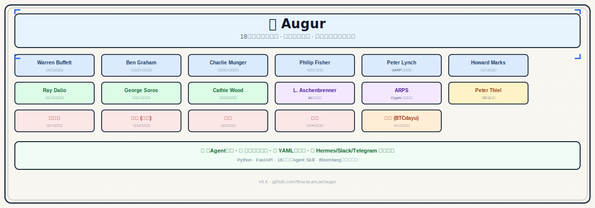
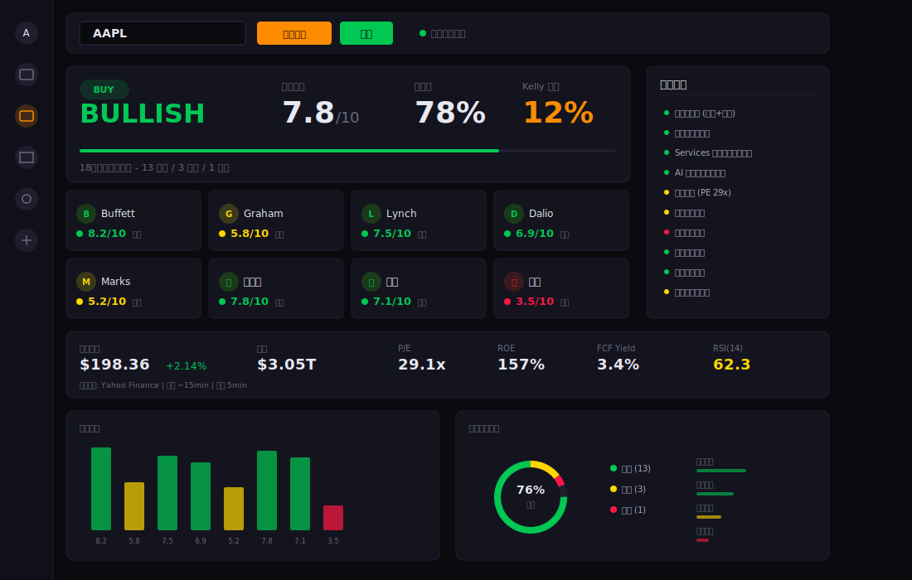

中文 | [English](README_EN.md)

<div align="center">



# 🦉 Augur

**Your AI Investment Committee**

*18 legendary investors. One consensus. Every time.*

[](https://github.com/BruceLanLan/augur)
[](#-18-investor-personas)
[](https://python.org)
[](https://modelcontextprotocol.io)
[](LICENSE)

</div>

---

> **Would Buffett buy this stock?** What does Dalio think about macro risk? Is management "benfun" (principled) by Duan Yongping's standard?
>
> Stop guessing from one angle. Augur lets **18 legendary investors** independently analyze any stock, each producing a structured score, then aggregates them into a weighted consensus with Kelly position sizing.

---

## 🆕 v7.8.0 New Features

| Feature | Description |
|---------|-------------|
| 📊 Bloomberg Dashboard Enhancement | SVG Fear & Greed Gauge, Market Pulse strip, International Markets panel, Sector heatmap mini-bar |
| 🎭 Custom Persona CRUD | List/edit/delete custom personas, purple CUSTOM badge |
| 🔐 API Token Authentication | AUGUR_API_TOKEN env var, Bearer Token middleware, Settings config panel |
| 🎨 UI Polish | Panel empty states with icons, JS error handling, CSS consistency, 480px mobile breakpoint |
| 📖 Integration Guide | MCP/REST/Python SDK/Hermes/OpenClaw single-persona integration docs |
| 🐳 Docker Improvements | docker-compose.yml passes Token, .env.example updated |

---

## 📋 Feature List

> Augur is a full-featured multi-agent investment analysis platform. Below are all core modules:

| Module | Feature | Description |
|--------|---------|-------------|
| 🧠 Multi-Agent Consensus | 18 Masters | 18 investor personas independently analyze, weighted consensus + Kelly sizing |
| 📡 Auto Data Fetch | Multi-Source | yfinance / Finnhub / Alpha Vantage / Stooq provider chain |
| 🔥 Sector Heatmap | 11 ETFs | Sector performance with color-coded change visualization |
| 😱 Fear & Greed | SVG Gauge | VIX-driven semi-circle gauge with gradient + needle animation |
| 🌏 International Markets | Asia + Europe | HSI, Nikkei, CSI300, FTSE, DAX real-time |
| 📋 Watchlist | Batch Analyze | Add/remove tickers, localStorage persistence |
| 🔍 Scanner | Heatmap Scoring | Preset ticker lists with parallel 18-master scoring |
| 📈 Backtest | IC Leaderboard | Hit rate + information coefficient ranking |
| 💼 Portfolio | Holdings P&L | Track positions, real-time gains, asset allocation chart |
| 🎭 Custom Persona | CRUD | No-code YAML creation, edit/delete management |
| 🔐 API Token | Bearer Auth | Environment variable config, middleware protection |
| 🤖 Multi-Platform Bots | Telegram/Slack/WeChat/Lark | Push notifications + alert thresholds |
| 🔌 MCP Integration | Claude / Hermes | MCP protocol server, single/all persona invocation |
| 🐳 Docker Deploy | Compose | One-command deployment with env config |
| 💻 CLI | Commands | augur analyze / consensus / report / inject-soul |
| ⏰ Cron Scheduler | Monitoring | Scheduled watchlist analysis, threshold alerts |
| 📄 Deep Reports | Download | Markdown/HTML export, professional visualization |
| 🌐 i18n | Bilingual | Chinese/English toggle with localStorage |

---

## 🆕 v7.7.0 New Features

| Feature | Description |
|---------|-------------|
| 💼 Portfolio Management | /portfolio page with holdings tracking, real-time P&L, asset donut chart, 7-day value curve, one-click Augur analysis |
| 🎭 Persona Deep Interaction | Ask individual masters questions (Ask Question), side-by-side comparison (Compare Two Masters) |
| 🔔 Cron Optimization | Threshold filtering fix, scheduled monitoring config UI, GET/PUT /api/cron/config, POST /api/cron/run-now |
| 📊 Dashboard Enrichment | Sector heatmap, top movers, Market Breadth, Consensus Leaderboard, international indices |
| 📄 Professional Reports | /report/{ticker} full-page view, score gauge SVG, download MD/HTML, copy to clipboard, voting table |
| 🎨 UI Polish | Global table sorting, active nav highlighting, Bloomberg dark theme consistency |

---

## 🆕 v7.6.0 New Features

| Feature | Description |
|---------|-------------|
| 📋 Watchlist | Add/remove tickers, localStorage persistence, batch analyze all |
| 📈 Sparkline Charts | 7-day close price SVG polyline, green for up / red for down |
| 📊 Historical Comparison | Compare analysis results for same ticker over time |
| 📦 Enhanced Export | JSON structured export + CSV master scores (pure frontend Blob) |
| 🔍 SEO & Open Graph | og:title/description/image + Twitter Card + robots.txt + sitemap.xml |
| 🏷️ Code Quality | Full type hints + docstrings in data.py, OpenAPI summaries, py.typed |

---

## 🆕 v7.5.0 New Features

| Feature | Description |
|---------|-------------|
| 🌐 i18n Internationalization | Chinese/English toggle, sidebar language switcher, localStorage persistence |
| 🔍 Scanner | Batch scoring heatmap, preset ticker lists, parallel 18-master scoring |
| 🔒 Security Hardening | IP rate limiting (30/min) / CORS middleware / input sanitization / API key masking |
| ⚡ Performance | ETag + 304 conditional requests / ThreadPoolExecutor concurrent data fetching |
| 🔔 Notifications | Telegram / Slack / Lark / WeChat test notifications + alert threshold config |
| 📄 Report Download | One-click Markdown export, copy to clipboard |
| 🤖 Single Agent Integration | MCP / REST / Python SDK access to individual persona agents (see [docs/single-persona-integration.md](docs/single-persona-integration.md)) |

---

## ✨ See It In Action

```
$ augur analyze NVDA

Auto-fetching data for NVDA from yfinance...
  Price: 820.00 | PE: 45.0 | ROE: 65.0% | GM: 78.0%

━━━━━━━━━━━━━━━━━━━━━━━━━━━━━━━━━━━━━━━━━━━━━━
  NVDA — 18 Masters Consensus
━━━━━━━━━━━━━━━━━━━━━━━━━━━━━━━━━━━━━━━━━━━━━━
  Signal:     BULLISH
  Score:      7.6 / 10
  Confidence: 82%
  Kelly Size: 9.2%

  Key Findings:
    • 🛡️ AI reinforcing moat, competitive advantage expanding
    • ⚡ Revenue 122%, clear AGI commercialisation path
    • 🚀 S-curve early rapid expansion phase

  BULLISH (11): buffett, fisher, aschenbrenner, cathie_wood, thiel...
  NEUTRAL  (5): dalio, marks, graham, soros, serenity
  BEARISH  (2): arps, munger
━━━━━━━━━━━━━━━━━━━━━━━━━━━━━━━━━━━━━━━━━━━━━━
```

---

## 🚀 30-Second Setup

```bash
git clone https://github.com/BruceLanLan/augur.git && cd augur

# Create virtual environment and upgrade pip (fixes old-version compatibility)
python3 -m venv .venv && source .venv/bin/activate
pip install --upgrade pip setuptools wheel

# Install Augur
pip install -e ".[data]"

# Start using
augur analyze AAPL         # auto-fetch live data + 18-master analysis
augur consensus NVDA       # consensus + Kelly position sizing
augur report TSLA          # generate deep analysis report
python3 -m dashboard.app   # launch Bloomberg-style Dashboard
# → open http://localhost:8000
```

---

## 📸 Dashboard Preview

> *Full screenshots coming soon*

Dashboard highlights:
- 🌐 **Global Market Overview** — Real-time S&P 500, NASDAQ, Hang Seng, CSI 300, VIX, Treasury, Gold, Crude, BTC
- 🔥 **Hot Tickers** — Top 10 tech/crypto tickers with live prices
- 😱 **Fear & Greed Indicator** — VIX-based market sentiment gauge
- 🎴 **Master Persona Cards** — 18 masters by school (Value/Growth/Macro/Quant/China)
- 🌗 **Dark/Light Theme** — One-click toggle with localStorage persistence
- 📊 **Deep Reports** — Downloadable as Markdown or PDF

---

## 💡 Why Augur?

| | Single Strategy | Ask ChatGPT | **Augur** |
|--|:--:|:--:|:--:|
| Analysis Angles | 1 | Random | **18 independent views** |
| Quantified Score | ✗ | ✗ | **0–10 structured score** |
| Chinese Investors | ✗ | Biased | **Duan / Zhang / Li Lu / Dan Bin** |
| Live Data | Manual | None | **yfinance auto-fetch** |
| Position Sizing | ✗ | ✗ | **Kelly formula** |
| Deploy to Claude/Hermes | ✗ | ✗ | **MCP Server** |

---

## 🧠 18 Investor Personas

<details>
<summary><strong>Classic Value</strong></summary>

| Investor | Framework | Best For |
|----------|-----------|---------|
| 🏆 **Warren Buffett** | Moat + owner earnings + FCF | Consumer/financial blue chips |
| 📐 **Benjamin Graham** | Margin of safety, P/E<15 P/B<1.5 | Deep value stocks |
| 🧠 **Charlie Munger** | Latticework + contrarian | Misunderstood quality businesses |
| 🔬 **Philip Fisher** | Scuttlebutt + margin sustainability | High-quality growth companies |

</details>

<details>
<summary><strong>Growth & Innovation</strong></summary>

| Investor | Framework | Best For |
|----------|-----------|---------|
| 🚀 **Peter Lynch** | PEG < 1.5 + everyday business | GARP growth stocks |
| 💡 **Cathie Wood** | Wright's Law + TAM expansion | AI/Genomics/Blockchain |
| 🏢 **Peter Thiel** | 0-to-1 monopoly + contrarian | Tech platforms / deep tech |
| 🤖 **Leopold Aschenbrenner** | AGI infrastructure + compute scarcity | AI / semiconductors |

</details>

<details>
<summary><strong>Macro & Cycle</strong></summary>

| Investor | Framework | Best For |
|----------|-----------|---------|
| 🌐 **Ray Dalio** | All-weather + debt cycle | Macro rotation |
| 🔄 **George Soros** | Reflexivity + self-reinforcing trends | Trend trading |
| 📉 **Howard Marks** | Pendulum sentiment + second-level thinking | Cycle bottoms |
| 🥇 **ARPS** | Real rates + Crypto/Gold macro | Inflation hedge |

</details>

<details>
<summary><strong>🇨🇳 Chinese Investors (Exclusive)</strong></summary>

| Investor | Framework | Best For |
|----------|-----------|---------|
| 🎯 **Duan Yongping** | Benfun (principled) + extreme concentration | Consumer tech with clear model |
| 🌏 **Zhang Lei (Hillhouse)** | Structural long-term value | Chinese growth sectors |
| 🏔️ **Li Lu (Himalaya)** | Deep value + margin of safety | HK/A-share undervaluation |
| 🫖 **Dan Bin (OrientalHarbour)** | Brand moat + era beta | Consumer champions |
| ₿ **BTCdayu** | Information edge + sentiment momentum | Crypto / narrative trading |

</details>

<details>
<summary><strong>Special Strategies</strong></summary>

| Investor | Framework | Best For |
|----------|-----------|---------|
| 🔭 **Serenity** | AI/semiconductor supply chain chokepoints | Critical bottleneck plays |

</details>

---

## 📊 Bloomberg Dashboard

```bash
python3 -m dashboard.app --port 8000 --cors
```

**7 pages** covering the complete analysis workflow:

| Page | Function | Highlight |
|------|----------|-----------|
| **Home** | Quick analysis + datasource status + hot tickers | Press `/` to focus, responsive mobile layout |
| **Stock Analysis** | 18-master consensus + visual report | Score card grid + bull/bear debate + risk matrix |
| **Personas** | 18-master cards + search/filter | Expand for factor weights |
| **Signal Monitor** | Watchlist batch scan | Auto-refresh every 60s |
| **Backtest** | IC leaderboard + hit rate | Track master accuracy |
| **Settings** | Per-master model config | Saved instantly |
| **Create Persona** | No-code YAML custom agent | Registers immediately |

**Report Download**: Supports PDF (window.print) and Markdown export for offline reading or sharing.

<p align="center">
  
</p>

---

## 🔌 Deploy Anywhere

### Claude Desktop / Hermes (MCP)

```bash
# Requires Python 3.10+ for MCP support
uv venv --python 3.11 .venv
uv pip install -e ".[mcp]"
.venv/bin/augur mcp-server   # verify it starts
```

**Hermes** (`~/.hermes/config.yaml`):
```yaml
mcp_servers:
  augur:
    command: /absolute/path/to/augur/.venv/bin/augur
    args: [mcp-server]

skills:
  external_dirs:
    - /absolute/path/to/augur/skills   # enables /skill augur-buffett etc.
```

**Claude Desktop** (`~/Library/Application Support/Claude/claude_desktop_config.json`):
```json
{
  "mcpServers": {
    "augur": {
      "command": "/absolute/path/to/augur/.venv/bin/augur",
      "args": ["mcp-server"]
    }
  }
}
```

7 MCP tools: `augur_analyze` · `augur_consensus` · `augur_fetch` · `augur_list_personas` · `augur_configure` · `augur_create_persona` · `augur_debate`

| Tool | What it does |
|------|-------------|
| `augur_analyze` | Analyze with one or all personas. Returns signal, score, key_findings, risks, reasoning. |
| `augur_consensus` | 18-master weighted consensus + Kelly position sizing. |
| `augur_fetch` | Fetch live market data only (no analysis). Great for chaining with analyze. |
| `augur_list_personas` | List all 18 investors with their ID, name, and philosophy. |
| `augur_configure` | Set which LLM model a specific persona uses. |
| `augur_create_persona` | Create a new YAML persona on the fly. |
| `augur_debate` | Run multi-round debate among agents on a ticker. |

> All tools auto-fetch live data from yfinance when no metrics are provided.

### Telegram / Slack / WeChat / Lark

```bash
pip install -e ".[telegram]" && export TELEGRAM_TOKEN='...' && augur telegram
pip install -e ".[slack]" && export SLACK_BOT_TOKEN='...' SLACK_APP_TOKEN='...' && augur slack
pip install -e ".[wechat]" && augur wechat --mode personal
pip install -e ".[lark]" && export LARK_APP_ID='...' LARK_APP_SECRET='...' && augur lark
```

### Docker

```bash
docker compose up -d dashboard           # http://localhost:8000
docker compose --profile telegram up -d  # + Telegram Bot
```

---

## ⚙️ Full CLI Reference (17 commands)

```bash
# ── Core Analysis ────────────────────────────────────────────────────────────
augur analyze AAPL                            # auto live data, all 18 masters
augur analyze NVDA --persona buffett          # specific master only
augur analyze TSLA --persona cathie_wood --json  # JSON output (for scripting)
augur consensus AAPL                          # weighted consensus + Kelly size
augur consensus NVDA --json                   # JSON output (incl. individual)
augur list-personas                           # list all 18 investors

# ── Data ─────────────────────────────────────────────────────────────────────
augur fetch 0700.HK                           # fetch live data (no analysis)
augur fetch AAPL --json                       # JSON format

# ── Backtest & IC Tracking ───────────────────────────────────────────────────
augur backtest AAPL --days 30 --live          # real yfinance history
augur backtest AAPL --demo                    # simulated data (quick demo)
augur ic-report                               # agent accuracy leaderboard

# ── Watchlist Monitoring ─────────────────────────────────────────────────────
augur watchlist-add AAPL --roe 0.55 --gross-margins 0.46 --sector Technology
augur watchlist-show                          # display current watchlist
augur cron-run                                # run watchlist analysis once
augur cron-start                              # start scheduled daemon (weekdays 9am)

# ── Services ─────────────────────────────────────────────────────────────────
python3 -m dashboard.app --port 8000 --cors   # Bloomberg Dashboard (full API)
augur api --port 8900                         # lightweight REST API
augur mcp-server                              # MCP Server (stdio, Python 3.10+)

# ── Hermes / Claude Integration ──────────────────────────────────────────────
augur inject-soul --persona buffett -f hermes --profile my-buffett

# ── Platform Bots ────────────────────────────────────────────────────────────
augur telegram    # pip install -e ".[telegram]" && export TELEGRAM_TOKEN=...
augur slack       # pip install -e ".[slack]"
augur wechat      # pip install -e ".[wechat]" (GeWeChat personal mode)
augur lark        # pip install -e ".[lark]"
```

**Parameter conventions (across all commands):**

| Type | Unit | Correct | Wrong |
|------|------|---------|-------|
| Rates / margins / growth | Decimal (0-1) | `--roe 0.55` (55%) | ~~`--roe 55`~~ |
| Debt ratio | Decimal (0-1) | `--debt-ratio 0.35` (35%) | ~~`--debt-ratio 35`~~ |
| Ownership | Integer percent | `--institutional-ownership 66` (66%) | ~~`--institutional-ownership 0.66`~~ |
| Market cap / FCF | **Billions USD** | `--market-cap 2800` ($2.8T) | ~~`--market-cap 2800000000000`~~ |

---

## 🔧 YAML Custom Personas

```yaml
# personas/custom/my_quant.yaml
agent_id: my_quant
name: "My Quant Strategy"
philosophy: ["momentum", "value", "low volatility"]
scoring_weights:
  momentum: 0.40
  value:    0.35
  safety:   0.25
factors:
  momentum:
    base: 5
    rules:
      - {if: "rsi > 55 and rsi < 75", add: 2}
      - {if: "macd > macd_signal",     add: 1}
  value:
    base: 5
    rules:
      - {if: "pe > 0 and pe < 15",     add: 3}
      - {if: "pb < 1.5 and pb > 0",   add: 2}
  safety:
    base: 5
    rules:
      - {if: "debt_ratio < 0.3",       add: 2}
      - {if: "current_ratio > 2",      add: 2}
```

---

## 📡 Dashboard API Endpoints

When Dashboard is running (`python3 -m dashboard.app --port 8000`), the following endpoints are available:

| Endpoint | Method | Description |
|----------|--------|-------------|
| `/api/analyze/{ticker}` | GET | 18-master consensus, auto-yfinance when no metrics |
| `/api/fetch/{ticker}` | GET | Fetch live market data only |
| `/api/personas` | GET | List all 18 investors |
| `/api/persona/{id}` | GET | Single investor details |
| `/api/config` | GET/PUT | Global config read/write |
| `/api/config/persona/{id}` | GET/PUT | Per-investor model config |
| `/api/models` | GET | Available LLM models |
| `/api/watchlist` | GET | Current watchlist |
| `/api/watchlist/add` | POST | Add to watchlist |
| `/api/watchlist/{ticker}` | DELETE | Remove from watchlist |
| `/api/watchlist/run` | POST | Batch analyze + save last signal |
| `/api/custom-persona` | POST | Create YAML persona (hot-reloads) |
| `/api/backtest/run` | GET | Run IC backtest |
| `/api/backtest/leaderboard` | GET | IC leaderboard |
| `/api/search` | GET | Ticker search |
| `/health` | GET | Health check |

---

## ❓ Troubleshooting

<details>
<summary>"yfinance not installed" error</summary>

```bash
pip install -e ".[data]"
```
</details>

<details>
<summary>MCP Server "No module named mcp"</summary>

The `mcp` package requires Python 3.10+:
```bash
uv venv --python 3.11 .venv
uv pip install -e ".[mcp]"
.venv/bin/augur mcp-server   # verify it starts
# then register the absolute path in ~/.hermes/config.yaml
```
</details>

<details>
<summary>Analysis always returns NEUTRAL with low scores</summary>

Check parameter units (the #1 mistake):
- ✅ `--roe 0.55` (55%)  ❌ ~~`--roe 55`~~
- ✅ `--debt-ratio 0.35` (35%)  ❌ ~~`--debt-ratio 35`~~
- ✅ `--market-cap 2800` ($2.8T)  ❌ ~~`--market-cap 2800000000000`~~
- ✅ `--gross-margins 0.46` (46%)  ❌ ~~`--gross-margins 46`~~
</details>

<details>
<summary>Dashboard stuck on "Loading"</summary>

```bash
# 1. Verify service is running
curl http://localhost:8000/health   # should return {"status":"ok","agents":18}

# 2. Make sure yfinance is installed (for auto-fetch)
pip install -e ".[data]"

# 3. Enable CORS for frontend calls
python3 -m dashboard.app --port 8000 --cors
```
</details>

<details>
<summary>Telegram Bot /analyze AAPL returns NEUTRAL with zero data</summary>

Install yfinance:
```bash
pip install -e ".[data,telegram]"
# Bot auto-fetches live data when no metrics are passed
```
</details>

<details>
<summary>Kelly position shows 0% or N/A</summary>

Kelly only returns a non-zero suggestion for BULLISH signal with score > 5. NEUTRAL/BEARISH signals conservatively return 0.
</details>

<details>
<summary>pip install error: "File 'setup.py' not found"</summary>

This happens because your pip version is too old to recognize `pyproject.toml`. Fix:

```bash
# Option 1: Use a virtual environment (recommended)
python3 -m venv .venv && source .venv/bin/activate
pip install --upgrade pip setuptools wheel
pip install -e ".[data]"

# Option 2: Upgrade system pip directly
python3 -m pip install --upgrade pip setuptools wheel
pip install -e ".[data]"
```

Note: macOS ships with an older pip (pip < 21) that doesn't support pyproject.toml. Upgrading pip resolves this.
</details>

<details>
<summary>Custom YAML persona doesn't appear after creation</summary>

The Dashboard supports hot-reload (saved YAML is immediately available in the same process). CLI/API will auto-load `personas/custom/*.yaml` on next restart.
</details>

---

## 📋 Changelog

### v7.3.1 — Dashboard Data Density & Report Enhancement

- Added hot tickers real-time panel (top 10), Fear & Greed indicator, and Macro Snapshot cards to home page
- Report visualization: investor style tags, key financial metrics panel, print optimization, copy report link
- Unified all page `<title>` tags, version bumped to v7.3.1
- New `/api/hot-tickers` endpoint

### v7.3.0

Dashboard enhancement + report visualization upgrade + multi-datasource chain + documentation (public release).

#### Dashboard Enhancement
- Datasource status panel: real-time display of yfinance/Finnhub/Alpha Vantage/Stooq connection status
- Quick analysis hot tickers: home page presets for GOOGL / BTC-USD / 00700.HK / BABA one-click analysis
- Responsive mobile layout: full mobile adaptation with auto-adjusting cards and tables

#### Report Visualization
- 18-master visual score card grid: individual score cards for each master at a glance
- Bull vs Bear two-column debate layout: opposing viewpoints displayed side-by-side
- Risk matrix cards: structured risk factor visualization
- Executive summary header card: core conclusions highlighted prominently
- PDF download (window.print with optimized print styles)
- Markdown download: one-click export of complete analysis report

#### Multi-datasource
- yfinance (primary) + Finnhub (optional) + Alpha Vantage (optional) + Stooq (fallback)
- Automatic datasource degradation chain: auto-switches to backup sources when primary fails

#### Documentation
- Bilingual README (CN/EN) synchronized update
- New [Single Persona Integration Guide](docs/single-persona-integration.md): three integration methods for Hermes / Open Claw / Claude Desktop
- New [Data Sources Guide](docs/data-sources.md)

---

### v7.2.0

Professional deep report + multi-source data + critical interaction fixes (pre-release hardening).

#### Deep Analysis Report (professional multi-master fusion)
- Full rewrite: executive summary is now the neutral "Investment Committee Verdict" that **fuses all 18 masters' perspectives — no longer biased toward Buffett's single framework**
- New modules: rating card (A-E grade + consensus strength), one-line verdict, 18-master scorecard (with school/framework), **per-school deep analysis** (value/growth/macro-risk/technical), **bull-bear debate** (top 3 bullish vs most cautious), **disagreement focus** (the most valuable part: identifies the biggest contention), consensus & risk matrix, position sizing
- Fixed financial units: ROE/margins/growth render correctly as percentages; market cap/FCF correctly scaled ($X.XXB / trillions)
- Float precision & markdown noise cleanup; dashboard report now renders rich Markdown (headings/tables/lists)

#### Data Source Expansion & Fixes
- New `src/augur/datasources/` provider abstraction: **yfinance first → Stooq fallback → empty context**, eliminating single point of failure
- **Fixed critical data corruption bug**: yfinance NaN values passed through `x or 0` (NaN is truthy) and polluted all metrics, corrupting persona scores — added `safe_num()` to uniformly sanitize None/NaN/inf
- Unit conversion and ownership clamping fixes

#### Interaction/UX Fixes (resolves "click analyze does nothing / can't see report")
- **Fixed frontend fetch not checking HTTP status**: backend errors (rate limit/invalid ticker/500) no longer render a fake empty "HOLD" result; clear errors shown instead
- Added first-run onboarding banner + one-click examples (AAPL/NVDA/TSLA/MSFT, no manual metrics needed)
- Staged loading progress + timeout protection (no more infinite spinner)
- "Generate Deep Report" promoted from hidden tiny button to prominent primary action; report failures show inline error + retry
- Friendly empty states, narrow-screen adaptation, actionable error messages

#### Testing
- Tests grew from 372 to 448 (new data source 33, report enhancement, frontend error handling, etc.)

---

### v7.0.0

Major version update after 7 iterations of code review, bug fixing, and optimization.

#### Security Fixes (Critical)
- **CRITICAL**: Replaced vulnerable `eval()` in `persona_loader.py` with AST-based sandbox, preventing arbitrary code execution via malicious YAML persona conditions
- **CRITICAL**: Fixed path traversal vulnerability in `soul.py` `inject_soul()`, preventing writes to arbitrary directories
- Fixed XSS vulnerability in Dashboard `signals.html` (inline onclick string interpolation)
- Added ticker regex validation across API, MCP, and Dashboard endpoints
- Added global exception handlers to prevent stack trace leakage via API responses

#### Bug Fixes
- Fixed ZeroDivisionError in `data.py` when yfinance returns negative `debt_to_equity`
- Fixed Dayu persona momentum elif chain ordering bug (shadowed branch)
- Fixed coordinator crash when all agents return ERROR (total_weight==0)
- Fixed CLI missing sector/industry parameters not passed to MarketContext
- Fixed cron config shallow merge losing nested default values (timezone, notifications)
- All 18 persona files now clamp scores to [0, 10] range
- Added division-by-zero guards in Munger and Dalio personas

#### Performance
- DecisionCoordinator now uses ThreadPoolExecutor for parallel 18-agent analysis (up to 8x speedup)
- Added 30s timeout per agent to prevent hanging
- Added performance timing instrumentation (analysis_ms + consensus_ms in metadata)
- Dashboard uses Page Visibility API to pause polling in background tabs

#### User Experience
- New `--no-color` CLI flag (also respects NO_COLOR environment variable)
- Improved CLI output formatting with aligned tables and bordered boxes
- All error messages are now actionable (include pip install commands, --help suggestions)
- Created `src/augur/errors.py` for consistent error response formatting
- Created `src/augur/optional_deps.py` for graceful degradation when optional deps missing
- Added ARIA accessibility labels across all Dashboard templates
- Dashboard API responses now include consistent `status` field and ISO 8601 timestamps

#### Infrastructure
- Dockerfile: Added non-root user `augur` for security
- docker-compose.yml: Removed deprecated `version` field, added healthchecks
- requirements.txt: Added missing `httpx>=0.24.0`
- Scanner module: Added 6 missing agent exports for backward compatibility
- Cron: Added PID file concurrency protection and SIGTERM handler

#### Testing
- Added 173 new regression tests (from 78 to 251 total)
- Full end-to-end pipeline tests (CLI + API)
- Data pipeline validation tests
- Dashboard error handling tests
- Security attack vector tests (eval injection, XSS, path traversal)
- Performance baseline tests

#### Architecture
- New modules: `cli_format.py`, `errors.py`, `optional_deps.py`, `bots/utils.py`
- Bot shared utils module eliminates ticker extraction code duplication

---

## 🤝 Contributing

See [CONTRIBUTING.md](CONTRIBUTING.md) for the full guide: new investors (YAML/Python), bug fixes, Dashboard work, Bot work, parameter conventions.

- **New investor** → Add YAML to `personas/custom/` or write Python like `src/augur/personas/buffett.py`
- **Algorithm** → Improve `src/augur/coordinator.py` consensus mechanism
- **New platform** → Add to `src/augur/bots/`, reference `telegram_bot.py`
- **UI** → Improve `dashboard/`, CSS variables in `bloomberg.css`

---

<div align="center">

MIT License · Built by [BruceLanLan](https://github.com/BruceLanLan)

*For educational and research purposes only — not investment advice*

</div>
