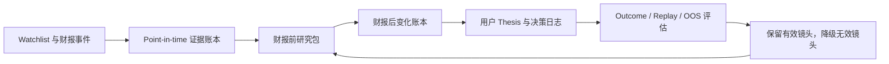

# Augur 产品方向与功能机会地图

- **状态**：Discovery / 方向约束，不等同于已承诺 backlog
- **研究日期**：2026-08-11
- **适用基线**：v11 Release Candidate 之后
- **执行计划**：[`docs/ROADMAP.md`](ROADMAP.md)
- **生态融合调研**：[`docs/research/FINANCIAL_PLATFORM_AGENT_SKILL_BENCHMARK_2026-08-11.md`](research/FINANCIAL_PLATFORM_AGENT_SKILL_BENCHMARK_2026-08-11.md)

## 一句话定位

> Augur 是面向美国公开市场研究者的 local-first、evidence-first 财报研究工作台：把 watchlist 变成可复验的财报前研究包，并在事件后准确展示“什么变了、依据是什么、哪些观点仍有分歧”。

Augur 不应把“18 位大师”或“多 Agent”本身当作产品。Persona 是分析镜头；真正的产品是一个持续积累的事件研究记忆系统。

## 为什么选择这个方向

通用赛道已经被更强的产品占据：

- [FinChat](https://finchat.io/) 已覆盖全球基本面、KPI、预期、所有权、IR 内容、财报日历、Dashboard 和 AI Copilot；Augur 不适合追求数据终端的横向完整度。
- [AlphaSense](https://www.alpha-sense.com/platform/generative-search/) 依靠付费内容、带引用检索、Deep Research 和 workflow agents 服务专业机构；Augur 无法用公共数据复制其内容壁垒。
- [OpenBB](https://docs.openbb.co/) 已把多数据源接入、可定制研究 Workspace 和自定义 Agent 作为核心平台能力；Augur 不应再造一个泛金融 Workspace。
- [TradingAgents](https://github.com/TauricResearch/TradingAgents)、[ai-hedge-fund](https://github.com/virattt/ai-hedge-fund) 和 [Dexter](https://github.com/virattt/dexter) 说明“金融多 Agent”很容易获得关注，也意味着泛 Agent 叙事高度拥挤、难以形成长期差异。

Augur 的现有 watchlist、cron/bots、EDGAR fundamentals、management guidance、内部人/机构持仓、persona 分歧、历史记录、Dashboard、CLI 和 MCP 已经能组成财报事件闭环。最值得建设的是这些能力之间缺少的证据、变化和复盘层。

## 产品飞轮

这个飞轮产生三个会随时间复利的资产：

1. **Point-in-time evidence graph**：事件、filing、事实、claim、来源时点、转换版本和 snapshot hash。
2. **Longitudinal event memory**：连续季度的 guidance、基本面、风险、管理层措辞、所有权、分歧和未解决问题变化。
3. **Replay/evaluation corpus**：明确缺失值和 look-ahead 约束的历史事件包，用来决定 persona、prompt、因子和权重是否值得保留。

## 优先功能组合

### P0：信任底座

#### 1. Claim-level Evidence Ledger

每个重要结论、图表和提醒都携带：

- 原始来源类型、URL 或 SEC accession number；
- publication/retrieval/as-of 时间；
- 原文 locator 或可打开的 source card；
- 数据转换、schema、model/prompt 和代码版本；
- coverage、missing、degraded 与 validation status。

缺失来源必须显示 unknown/abstain，不能显示为 neutral 或 0。导出的报告同时生成 machine-readable evidence manifest。

#### 2. Reproducible Research Run Bundle

每次分析保存不可变的输入 snapshot、数据获取时间、配置、persona/prompt/model 版本、代码 revision、结构化输出和缺失统计。相同 bundle 可在离线 cache 上复验；空数据或验证失败只能得到 `unvalidated`，不能产生性能徽章。

### P1：财报事件核心闭环

#### 3. Watchlist Earnings Queue

把 watchlist 变成未来财报事件队列，显示：

- 事件时间及其可信度；
- filing、fundamentals、guidance、ownership 等来源新鲜度；
- dossier readiness 和缺失项；
- 已生成、需要刷新、因证据不足而暂停的状态。

#### 4. Pre-event Earnings Dossier

生成结构化财报前研究包：上一期 guidance、关键 KPI 变化、近期 filing/内部人/机构行为、主要风险、分析镜头分歧、待回答问题和 bull/base/bear 场景变量。每项事实直接链接 Evidence Ledger。

#### 5. Since-last-event Change Ledger

相较上一个有效事件 snapshot，只展示重要变化：

- guidance 与管理层措辞；
- 基本面和估值输入；
- risk factors 与新增 filing；
- ownership/insider 变化；
- persona 分歧、abstention 和结论变化。

变化账本比重新生成一份“公司简介”更接近高频研究需求。

#### 6. Evidence-backed Disagreement Map

从 18 份并列输出收敛为少量决策相关冲突：谁在什么事实和假设上不同、各自证据是什么、哪一项新信息会改变判断。未验证 persona 不参与排名；缺失输入的 persona 明确 abstain。

### P2：让用户回来，而不是只生成一次报告

#### 7. Thesis Journal 与 Thesis Delta

用户可记录投资 thesis、催化剂、主要风险、证伪条件和未解决问题。两次 run bundle 之间自动生成 thesis delta，用户标记 `intact / weakened / refuted` 并写原因。所有变化必须指向事实差异，而不是只比较生成文本。

#### 8. Material Catalyst Alerts

提醒从“分数超过阈值”升级为明确状态变化：新 filing/guidance、财报 dossier ready、内部人集群交易、机构覆盖变化、分歧显著扩大或 thesis 证伪条件触发。提醒需要 event dedupe、cooldown、触发解释和 evidence/diff 链接。

#### 9. Post-event Scorecard

财报后将 pre-event 问题、场景和事实与实际披露逐项对照，记录哪些判断被证实、证伪或仍未知。Scorecard 不给交易归因，而是评估研究过程和信息覆盖。

### P3：把可信度变成工程壁垒

#### 10. Chronological Evaluation Lab

使用不可变事件 bundles，在锁定的 walk-forward/OOS 窗口中比较 persona、prompt、因子或权重改动：

- 观察数量、日期和 ticker 覆盖；
- missingness 与有效覆盖率；
- baseline 对照、IC/Brier/log loss 和不确定性；
- cohort regression 与 promotion decision。

实验不能自动改变默认产品行为；只有过 gate 并经 maintainer 明确批准后才能晋级。

#### 11. Public Research Evidence Pack

发布一个版本化、可引用的研究证据包格式，包含 retrieval manifest/hash、point-in-time inputs、outcome definition、人工复核的 claim/citation cases 和预注册 evaluation config。公共 filing 不是壁垒，持续维护的复验与事实质量记录才是。

### P4：验证核心留存后再做的邻接方向

以下功能有价值，但必须由财报闭环的真实使用触发：

- peer/relative valuation workbench；
- filing corpus 的带引用问答和跨季度措辞搜索；
- 可编辑的 bull/base/bear scenario lab；
- 研究笔记、Markdown/PDF/Notion-style export；
- OpenBB custom backend/app 或标准化 MCP package；
- source、persona、report template、event workflow 的稳定 extension contract；
- 小团队的私有数据适配、共享模板和 self-hosted Research Ops。

## 六个月发展路径

| 阶段 | 产品结果 | 进入下一阶段的门 |
|---|---|---|
| v11 周 | RC、可复现安装、最小 earnings workflow | first valid report <10 分钟；无 P0 provenance/degradation 缺陷 |
| Month 1 | Evidence Ledger + Run Bundle | 核心 claims 全部带来源/时点；snapshot 可复验 |
| Month 2 | Earnings Queue + pre/post dossier + change ledger | 支持范围内 ≥80% 事件在 24 小时前 ready |
| Month 3 | Thesis Journal + catalyst alerts | 5 位用户进入第二个财报周期；提醒无明显疲劳 |
| Month 4 | Scorecard + Evaluation Lab + 公开 evidence pack | ≥100 个历史事件具备明确 missingness 的 pre/post replay |
| Month 5 | 一个互操作入口与贡献规范 | 一个非维护者完成扩展并跨 release 通过兼容测试 |
| Month 6 | 小规模 Research Ops 付费试点 | 3 个合格访谈，至少 1 个付费试点或明确的否定证据 |

## 北极星指标与 kill criteria

### 产品指标

- fresh install 到第一份有效 dossier <10 分钟；
- 财报事件识别正确率 ≥90%；
- 支持 universe 中 ≥80% 的事件在 24 小时前生成 ready dossier；
- 抽样 claim/source 对应准确率 ≥98%；
- 用户研究准备时间中位数下降 ≥50%；
- 六个月内 ≥10 位独立用户使用 watchlist，≥5 位连续使用两个财报周期；
- 维护数据源故障的时间不超过维护者容量的 25%-30%。

### 停止或收缩条件

- 公共数据无法稳定覆盖 80%：缩小支持 universe，而不是无边界增加 provider。
- 引用准确率达不到 98%：停止新增功能，先修证据链。
- 用户认为它只是“LLM summary + links”：重新验证产品定位。
- persona OOS 不优于简单 baseline：取消排名、预测性语言和默认权重，仅保留可引用的定性镜头。
- 六个月后不足 5 位用户进入第二个财报周期：停止扩张并重新做问题发现。

## 项目与商业化方向

建议采用 **trusted OSS product → evaluation/extension substrate → optional Research Ops** 的顺序：

1. 核心 runtime 保持宽松开源，以本地运行、隐私和可复验降低采用门槛。
2. 用 official/compatible policy、兼容测试和 trademark/发行规范建立“官方可信版本”，而不是急着建 marketplace。
3. 社区贡献对象优先是 replay fixture、citation correction、source adapter、report template 和 challenge case，而不是继续增加 persona 数量。
4. 初期商业化卖部署可靠性、私有 source adapter、共享模板、升级支持和 evaluation setup，不卖“秘密 alpha”或准确率承诺。
5. 至少三个团队独立为相同协作/运维问题付费后，才评估 hosted control plane、团队权限和订阅产品。

数据与分发需要遵守来源条款。[SEC Developer Resources](https://www.sec.gov/about/developer-resources) 明确要求负责任地访问 EDGAR；商业数据、新闻、社交和 LLM 输出默认采用 BYO-key/provider，未核实再分发权利前不打包转售。

## 六个月内明确拒绝

- 泛化的“AI 股票推荐/多 Agent 炒股”定位；
- 自动交易、broker sync、目标价、仓位建议和投资回报承诺；
- 全量全球数据、实时新闻/社交情绪 firehose、付费预期数据平替；
- generic data terminal、generic workspace 或 connector 数量竞赛；
- portfolio accounting、税务、移动原生客户端；
- 未经 OOS gate 的动态权重、综合 confidence 和“已校准概率”；
- 无审核的 persona/plugin marketplace；
- multi-tenant SaaS、计费和复杂团队权限。

## 每个新功能必须回答的五个问题

1. 它是否缩短 watchlist 到有效 dossier 的时间？
2. 它是否让来源、时点、缺失项或变化更清楚？
3. 它是否增加下一次财报周期的回访理由？
4. 它是否复用统一事件、证据和 run bundle，而不是复制业务逻辑？
5. 如果失败，能否用可观测指标明确关闭，而不是继续投入？

不能至少满足前三项中的两项，或无法回答第五项的功能，不进入 roadmap。
