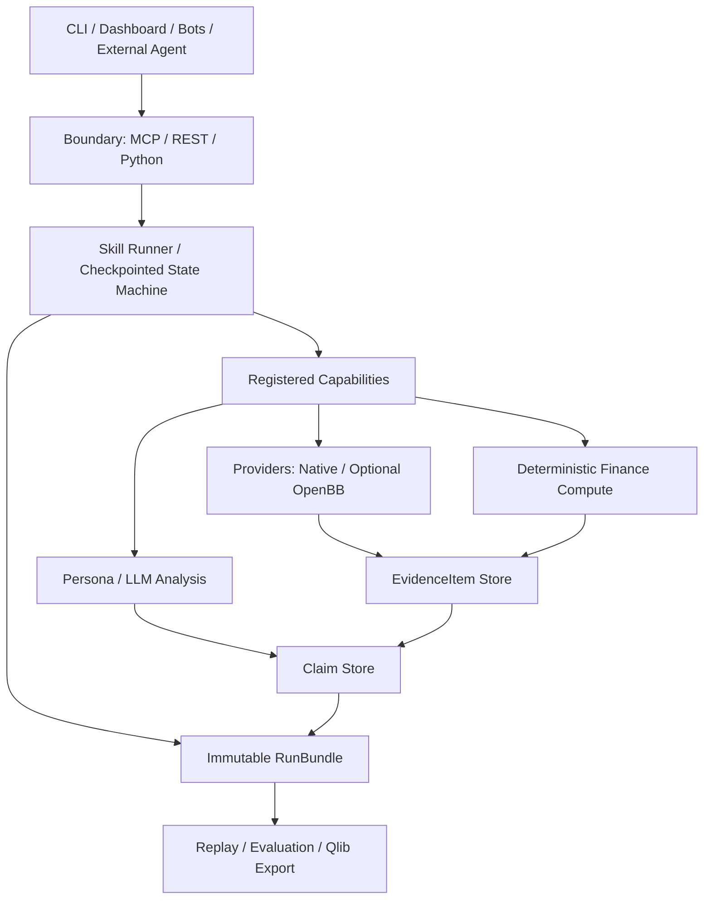

# 金融平台、分析 Agent 与 Skill 生态调研及 Augur 融合方案

- **状态**：Architecture / Product recommendation
- **研究日期**：2026-08-11
- **适用范围**：v11 RC 之后的生态兼容与能力建设
- **前置文档**：[`docs/PRODUCT_DIRECTIONS.md`](../PRODUCT_DIRECTIONS.md)、[`docs/ROADMAP.md`](../ROADMAP.md)

## 执行结论

Augur 不应把 OpenBB、Qlib、LEAN、LangGraph 或某个社区金融 MCP/Skill 变成核心依赖。最合适的路线是：

> **自己持有一层很小、可审计的 Evidence / Claim / Run / Capability / Skill 合约；在边界兼容优秀生态，在核心内保持 local-first、evidence-first。**

应该融合的是成熟项目已经验证的工程模式：

1. OpenBB 的 provider/metamodel 与 one-core/multi-surface；
2. Qlib 的 experiment/recorder、配置化实验和显式 train/valid/test；
3. LEAN 的 information-time/time-frontier 与不可变运行产物；
4. FinRobot 的确定性金融计算与 LLM 叙述分离；
5. TradingAgents 的分阶段反方审查、checkpoint 和 decision log；
6. Dexter 的任务计划、tool trace 和可复核 scratchpad；
7. Agent Rita 的 thin harness、结构化 MCP 结果与分层测试；
8. Agent Skills 的渐进式披露、manifest 和按需加载；
9. MCP 对 tools、resources、prompts 三类能力的明确分工。

明确不融合：自动交易、broker gateway、目标价/仓位建议、社交情绪流、任意第三方脚本执行、无审核 skill marketplace，以及为了“多 Agent”而增加更多角色。

## 调研方法与边界

本次以官方仓库、官方文档和规范为主，考察的是架构、运行合约、证据处理、扩展机制与评估方法，不用 GitHub stars 代替产品判断。社区 Skill 仅用于观察模式和反模式，不直接复制；引入任何代码前仍需逐项确认 license、数据再分发权和安全边界。

调研对象分为三组：

- **金融操作/研究平台**：OpenBB、Qlib、LEAN、vn.py；
- **金融分析 Agent**：TradingAgents、ai-hedge-fund、FinRobot、Dexter、OpenBB Agent Rita；
- **Skill/MCP 生态**：Agent Skills specification、Model Context Protocol、社区 SEC/股票研究 Skill 与金融 MCP server。

## 竞品与模式矩阵

| 项目 | 最值得学习的能力 | 对 Augur 的融合方式 | 不应带入的部分 |
|---|---|---|---|
| [OpenBB](https://docs.openbb.co/odp/python/developer/architecture_overview) | 标准 endpoint metamodel、可独立安装 provider、同一核心供 Python/REST/MCP 等界面使用 | 设计可选 `OpenBBProviderAdapter`；保持 Augur 自己的 evidence schema | 把 OpenBB 变成运行时硬依赖；追求全数据终端 |
| [Qlib](https://qlib.readthedocs.io/en/stable/component/recorder.html) | Experiment → Recorder、参数/指标/产物留档、YAML workflow | 借用 recorder 语义；后续提供 Qlib/MLflow-compatible export | 把研究产品改造成完整量化训练平台 |
| [LEAN](https://www.quantconnect.com/docs/v2/writing-algorithms/key-concepts/algorithm-engine) | 流式 time frontier、回测与实时同一事件语义、运行结果与失败数据请求留档 | 核心 evidence 增加 `available_at`；历史 replay 做信息时点门禁 | 交易引擎、订单、broker 与实盘状态机 |
| [vn.py](https://github.com/vnpy/vnpy/blob/master/README_ENG.md) | EventEngine、gateway/app/database 的模块边界 | 有多个事件消费者后再采用小型 event bus | 交易 gateway 和交易系统复杂度 |
| [TradingAgents](https://github.com/TauricResearch/TradingAgents) | 分阶段角色、checkpoint resume、decision log、数据防穿越 | 把“辩论”改为 claim/challenge/re-query/revision 协议；用作对抗性 benchmark | LangGraph 硬依赖、交易决策链、社交情绪输入 |
| [ai-hedge-fund](https://github.com/virattt/ai-hedge-fund) | fund mandate 与 ticker universe/alpha model 分离 | 将研究目标、允许数据、风险约束做成独立 mandate/profile | 模拟基金、组合交易和“AI hedge fund”定位 |
| [FinRobot](https://github.com/AI4Finance-Foundation/FinRobot) | DCF/WACC/comps 等纯 Python 确定性计算；LLM 只做推理与叙述；数值 provenance | 建立 `deterministic_compute` capability；叙述层只能引用计算产物 | 整套桌面/Agent 框架与超出当前产品闭环的估值面板 |
| [Dexter](https://github.com/virattt/dexter) | 任务计划、逐步 tool trace、JSONL scratchpad、eval suite | RunBundle 保存 plan/step/tool/result；做失败与证据完整性评估 | 把 LLM-as-judge 当作主要质量门 |
| [Agent Rita](https://github.com/OpenBB-finance/agent-rita) | thin harness、能力放 MCP、typed results、引用聚合、unit/integration/nightly eval | MCP 只做传输层；统一 artifact/citation/table 结果；采用三级测试 | 能力无限增长后依赖 prompt 维持安全 |
| [Agent Skills](https://github.com/agentskills/agentskills/blob/main/docs/specification.mdx) | `SKILL.md` + references/assets/scripts、渐进式披露、manifest 校验 | 兼容其发现与文档组织方式；Augur 执行层使用更严格声明式子集 | 默认允许第三方 scripts 和任意工具权限 |
| [MCP](https://modelcontextprotocol.io/docs/learn/server-concepts) | Tool=动作、Resource=只读上下文、Prompt=用户触发模板 | Evidence/Run 作为 resources，研究 SOP 作为 prompts，原子动作才做 tools | 把全部功能塞进返回字符串的“大工具” |

## 对当前 Augur 的判断

Augur 已经有足够好的扩展种子，不需要重新选择一个“大框架”：

- [`src/augur/datasources/base.py`](../../src/augur/datasources/base.py) 的 `DataProvider` 已有 provider 抽象和 fallback 语义，但目前只接受 ticker 并返回普通字典，缺少 capability、coverage、freshness、license 和三类时间；
- [`src/augur/plugins.py`](../../src/augur/plugins.py) 已有 Python entry point plugin，但它是维护者信任的代码扩展，不适合作为不可信 Skill 执行沙箱；
- [`src/augur/persona_loader.py`](../../src/augur/persona_loader.py) 已支持 YAML persona 和权重校验，但 Persona 是分析镜头，不是工作流；
- [`src/augur/workflow.py`](../../src/augur/workflow.py) 的 `run_workflow` 同时负责抓取、分析、共识、委员会、辩论和情绪，适合先包裹 phase boundary，不适合在验证合约前整段重写；
- [`src/augur/mcp_server.py`](../../src/augur/mcp_server.py) 的 workflow tool 最终返回字符串，MCP 目前偏 tool-heavy，证据和运行产物还不能被稳定读取、链接和组合；
- [`src/augur/registry.py`](../../src/augur/registry.py) 的 debate round 只把已有摘要追加为新的 `key_findings`，没有重新取证、提出结构化反例或修正 claim，因此现在属于“辩论展示”，还不是 evidence-seeking debate；
- backtest、learning、history 和 cache 已提供 replay/outcome 的基础，但需要统一 RunBundle 与 information-time 约束后才能成为可信评估底座。

核心缺口不是 agent 数量，而是：**外部数据如何成为证据、证据如何支持 claim、工作流如何留下可恢复状态、Skill 如何在受限权限下复用这些能力。**

## 融合后的目标架构



依赖方向必须向内：外部 adapter 可以依赖 OpenBB/MCP/Qlib，但领域核心不能依赖它们的对象模型。

### 1. Domain contracts

#### `EvidenceItem`

最小字段：

- `evidence_id`、source/provider、source locator/URL/accession、content hash；
- instrument、metric/field、value、unit、currency；
- `effective_at`：事实对应的业务时点；
- `available_at`：市场或研究者最早能获得该信息的时点；
- `retrieved_at`：本次系统获取时点；
- transform/schema/code version、coverage/missing/degraded；
- license/redistribution metadata。

`available_at` 不得用 `retrieved_at` 替代；否则历史回放仍可能穿越。

#### `Claim`

Claim 不只保存文本，还保存结构化关系：

- `supports`、`contradicts`、`insufficient` 对应的 evidence IDs；
- fact / inference / scenario 分类；
- confidence 只能来自显式规则或校准模型；
- evidence 不足时必须 `unknown/abstain`。

#### `StepResult` 与 `RunBundle`

- `StepResult`：typed success/failure、输入/输出引用、诊断、provenance、耗时和 hash；
- `RunBundle`：不可变 run manifest、输入快照、步骤结果、配置/模型/代码版本、coverage/missingness 和最终产物；
- 新运行通过 supersedes 关系替代旧运行，不修改历史 bundle；
- replay 的承诺是恢复输入与执行状态，不是要求随机 LLM 逐字复现。

#### `ResearchEvent`

只作为 append-only 状态变化 envelope，不成为新的“万能业务对象”。例如 filing published、dossier ready、claim revised、thesis weakened。

### 2. Capability、Skill、Persona 必须分离

| 概念 | 职责 | 是否执行代码 | 信任级别 |
|---|---|---:|---|
| Provider | 获取并标准化外部数据/证据 | 是 | 维护者安装的可信代码 |
| Capability | 原子检索、计算、比较、验证能力 | 是 | 注册、版本化、权限受控 |
| Skill | 用户触发的研究 SOP，连接已注册 capability | 否；v1 仅声明式 | 可审计、可导入 |
| Persona | 分析哲学、关注点、prompt、评分镜头 | 否 | 不决定工具权限 |
| Workflow | Skill 的实际执行状态与 step graph | 由 runner 执行 | checkpoint、预算和超时受控 |
| Plugin | 新 provider/capability 的 Python 实现 | 是 | 只允许维护者审核安装 |

这样可以兼容 Agent Skills 的发现体验，同时避免 `SKILL.md` 变成任意代码执行入口。

### 3. `SkillSpec v1`：兼容生态但缩小攻击面

```yaml
id: earnings-prep
version: 1.0.0
description: Build a point-in-time pre-earnings research dossier.
license: Apache-2.0
compatibility: ">=11,<12"

inputs_schema:
  required: [ticker, event_id, as_of]

required_capabilities:
  - sec.filings.read
  - fundamentals.snapshot
  - market.price_history
  - runs.compare

permissions:
  resources: [evidence.read, runs.read]
  network_domains: [sec.gov]

evidence_policy:
  information_time_required: true
  missing: abstain
  min_claim_coverage: 0.95

workflow:
  - id: collect
    uses: earnings.collect_evidence
  - id: compare
    uses: runs.compare
    needs: [collect]
  - id: synthesize
    uses: report.earnings_dossier
    needs: [collect, compare]

outputs_schema:
  required: [run_id, dossier, evidence_manifest]

evals:
  fixtures: [earnings-prep-v1]
  gates: [citation_validity, no_lookahead, missingness_visible]
```

v1 禁止 module path、import、shell、任意文件访问、表达式求值和未注册网络访问。需要代码的扩展必须成为单独 Plugin/Capability，经过维护者审核。

## MCP 融合方案

当前 MCP 不需要增加更多“大工具”，而应补齐资源和结构化输出。

### Resources：只读、可缓存、可链接

- `augur://evidence/{evidence_id}`
- `augur://runs/{run_id}`
- `augur://events/{ticker}/{event_id}`
- `augur://skills/{skill_id}`

### Prompts：用户主动选择的研究工作流

- `earnings-prep`
- `filing-delta`
- `thesis-review`
- `debt-covenant-review`
- `post-earnings-scorecard`

### Tools：原子且有副作用边界的动作

- `create_run`
- `execute_skill`
- `compare_runs`
- `verify_claims`
- `get_coverage`

每个 tool 使用 input/output JSON Schema；返回 artifact、citation、table 或 resource link，而不是只返回拼接字符串。默认只读，创建运行等动作显式授权；外部 MCP 的结果必须先标准化、hash 和持久化，才能成为 EvidenceItem。

## 真正的 evidence-seeking debate

不要增加“辩论轮数”。将现有流程改成四个可测阶段：

1. **Independent claims**：各 Persona 独立给出结构化 claim 和 evidence IDs；
2. **Challenge**：反方只能提出带矛盾证据、证据缺口或逻辑漏洞的 counterclaim；
3. **Re-query**：只对争议 claim 调用检索/计算 capability，不重跑整份报告；
4. **Revision/Judgment**：输出 `supported / contradicted / unknown`、未解决事实和修订记录。

固定评估集必须证明它能提高 citation validity、矛盾发现率或 claim 修正率。若只增加文本、延迟和 token，默认关闭该功能。

## 首批五个金融研究 Skill

| Skill | 用户问题 | MVP 验收 |
|---|---|---|
| `earnings-prep` | 财报前最需要知道什么？ | prior guidance、关键 KPI、分歧、待验证问题全部有 evidence；不足时 abstain |
| `filing-delta` | 新 filing 与上一份相比什么变了？ | material section/number change 可定位到原文；无变化不生成噪声 |
| `thesis-review` | 新证据让 thesis 如何变化？ | 只比较两个有效 RunBundle；每项 delta 链接变化证据 |
| `debt-covenant-review` | 债务约束和流动性风险是什么？ | 以 filing 为权威来源，区分事实/推断，列出 source gaps |
| `post-earnings-scorecard` | 财报前问题和场景后来怎样？ | 逐项 `confirmed/refuted/unknown`，不做事后改写 |

这些 Skill 应先作为仓库内置、固定版本、带 fixture 的官方 Skill。至少等一个外部贡献者能通过兼容套件、权限检查和证据 gate 后，再考虑第三方目录；当前不做开放 marketplace。

## Build / Adapt / Defer 决策

### 现在自建

- EvidenceItem、Claim、StepResult、RunBundle 和 information-time 合约；
- capability registry、声明式 SkillSpec、最小 checkpoint state machine；
- MCP resources/prompts/tools 分离和结构化结果；
- 首批官方 Skill、compatibility/eval fixtures；
- 真正的 claim challenge/re-query 协议。

### 边界适配

- OpenBB provider：作为可选数据入口，不改变 canonical schema；
- Qlib/MLflow：作为实验产物导出目标，不接管 Augur workflow；
- Agent Skills：兼容 metadata/目录发现，执行语义采用 Augur 受限子集；
- 外部 Agent/MCP：作为客户端或 evidence provider，经 normalize/persist 后使用。

### 延后或拒绝

- LEAN/vn.py 引擎集成、broker 和自动交易；
- LangGraph 等通用 orchestration 硬依赖；
- 社区 Skill 自动安装与任意 scripts；
- generic copilot、finance MCP 数量竞赛；
- LLM-as-judge 单独决定质量、排名或默认晋级。

## 开发顺序

本调研中的第一批基础能力已经纳入唯一有日期的 7 天 v11 RC 计划，详细日程、降级策略和退出门见 [`docs/ROADMAP.md`](../ROADMAP.md)：

- Day 1 冻结 Evidence/Claim/StepResult/RunBundle schema、三类时间与 Skill 安全边界；
- Day 2 用 phase wrapper 生成第一份 RunBundle 和本地 checkpoint，不重写 `run_workflow`；
- Day 3 将 replay/provider 输出接入 Evidence 与 missingness/no-lookahead contract；
- Day 4 实现最小 Capability registry、SkillSpec validator 和两个内置 Skill fixtures；
- Day 5 增加 Evidence/Run MCP resources、typed results 和权限拒绝审计；
- Day 6 通过 `earnings-prep`/`filing-delta` 完成财报前 dossier 与变化比较；
- Day 7 完成 citation、permission、replay、source/wheel 和 release gates。

本周只实现支撑两个内置 Skill 的最小执行面，不建设通用 DAG、第三方脚本运行时或 marketplace。若 Day 3 仍无法在不改变现有结果的情况下生成 baseline-equivalent RunBundle，则停止 state-machine 扩展，只保留 schema、phase wrapper 和 feature flag，优先保证 RC 正确性。

以下集成已经登记，但不设置日期，后续只有进入新的 7 天计划才算承诺开发：

| 候选 | 进入条件 |
|---|---|
| 完整 evidence-seeking debate | 固定评估集证明 citation/矛盾发现收益，且成本在预算内 |
| OpenBB provider adapter | canonical Evidence schema 经真实运行稳定，adapter 故障可隔离 |
| Qlib/MLflow-compatible export | RunBundle versioning 和信息时点语义冻结 |
| 更多官方 research Skills | 前两个 Skill 的 fixture、权限和 missingness gate 稳定 |
| 外部 Agent client / MCP provider | 外部结果能 normalize/persist，且授权/超时/许可可审计 |
| 社区兼容套件与 catalog | 至少一个外部贡献者通过安全、许可和跨版本测试 |
| 通用 checkpoint state machine | phase wrapper 的真实数据证明抽象可复用，不围绕单一 workflow 设计 |

## 安全、许可证与维护门

任何外部 adapter、Skill 或 MCP 必须同时满足：

1. **权限**：声明 allowed capabilities、network domains、文件和数据范围；默认无写权限；
2. **证据**：结构化输出能转换成 EvidenceItem，包含 source locator 与 information time；
3. **失败语义**：超时、无覆盖、来源失败必须是 degraded/unknown，不能伪装 neutral；
4. **复验**：有 fixture、离线 replay 和 schema compatibility tests；
5. **许可证**：代码、prompt/模板、数据再分发权分别核实并写入 manifest；
6. **维护**：第三方 schema 变化不会迫使 Augur 修改核心合约；
7. **产品边界**：不得输出自动交易、broker 指令、保证收益、默认目标价或仓位建议。

社区金融 MCP 与 Skill 的抽样结果高度分散：有些只是带固定 P/E/ROE 阈值的长 prompt，有些则具备 SEC 权威来源顺序、source gap、刷新条件和 stop rules。可借鉴后者的 SOP 结构，但不能把“能调用一个自然语言金融工具”视为可信数据契约。

## 成功指标与 kill criteria

### 成功指标

- 100% RunBundle 包含代码/config/model/provider/schema 版本；
- 核心 claim 的可解析 evidence coverage ≥98%；
- 历史 replay 中 100% evidence 有 `available_at` 或显式 `unknown`；
- checkpoint 能在无网络条件下恢复已消费的输入和步骤状态；
- 首批 Skill 的 fixture、权限和 missingness gate 全部通过；
- 外部 adapter 故障不影响 native workflow；
- debate 相比无 debate baseline 提高 citation validity/contradiction discovery，且延迟与 token 在预算内。

### Kill criteria

- adapter 迫使核心 schema 围绕外部 metamodel 改写：停止该集成；
- provider-specific 字段不断进入核心对象：移入 namespaced extensions；
- Skill 能通过任何参数执行未注册代码/路径/网络：拒绝发布；
- checkpoint 需要重新联网才能恢复已完成步骤：不得宣称 replay；
- debate 只增加 prose、延迟和 token：默认关闭；
- 社区扩展的审核/兼容维护超过维护容量 25%：冻结 catalog；
- 新入口没有提高 dossier 完成率、证据覆盖或复访：停止 connector 扩张。

## 参考资料

- [OpenBB Architecture Overview](https://docs.openbb.co/odp/python/developer/architecture_overview)
- [OpenBB Provider Extensions](https://docs.openbb.co/odp/python/extensions/providers)
- [Qlib Experiment Manager & Recorder](https://qlib.readthedocs.io/en/stable/component/recorder.html)
- [Qlib Workflow](https://qlib.readthedocs.io/en/stable/component/workflow.html)
- [LEAN Algorithm Engine](https://www.quantconnect.com/docs/v2/writing-algorithms/key-concepts/algorithm-engine)
- [LEAN Backtest Results](https://www.quantconnect.com/docs/v2/local-platform/backtesting/results)
- [vn.py](https://github.com/vnpy/vnpy)
- [TradingAgents](https://github.com/TauricResearch/TradingAgents)
- [ai-hedge-fund](https://github.com/virattt/ai-hedge-fund)
- [FinRobot](https://github.com/AI4Finance-Foundation/FinRobot)
- [Dexter](https://github.com/virattt/dexter)
- [OpenBB Agent Rita](https://github.com/OpenBB-finance/agent-rita)
- [Agent Skills Specification](https://github.com/agentskills/agentskills/blob/main/docs/specification.mdx)
- [MCP Server Concepts](https://modelcontextprotocol.io/docs/learn/server-concepts)
- [MCP Tools Specification](https://modelcontextprotocol.io/specification/2025-06-18/server/tools)

## 最终取舍

Augur 的生态战略不是“连接最多工具”，而是定义一个更可信的研究产物标准：任何 provider、agent、persona 或 skill 进入系统后，都必须留下同一种可验证的 evidence、claim、time、run 和 evaluation 记录。做到这一点，OpenBB、MCP、外部 Agent 和社区 Skill 才会成为可替换的增长入口，而不是新的技术债。
